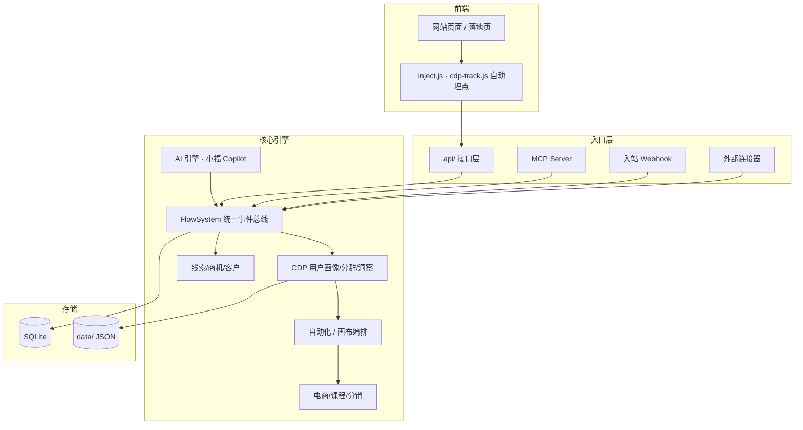
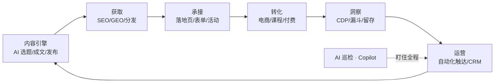

# OpenFlow XMP

> **AI 时代的网站增长操作系统 —— 让网站自己获得增长**

一个开箱即用的 PHP 单体应用：内容、SEO/GEO、用户数据（CDP）、营销自动化（MA）、CRM、电商、课程、社区，一个系统内打通。加上一个会主动干活的 AI 增长引擎。

**芭乐派**是主品牌（增长方法论 + 门派社区），**OpenFlow** 是它的开源底座。理论（方法论）→ 工具（平台）→ 落地（AI 增长引擎）三位一体，核心能力永久开源。

<div align="center">

  [](https://github.com/sevenaaaaaaaaa/openflow/actions)  

</div>

---

## 📌 产品定位

### 它是什么

OpenFlow 不是"又一个建站工具"，而是一套**增长操作系统**。它把网站的每一项能力——内容生产、搜索获取、用户洞察、自动化触达、交易转化——串成一个**自动运转的增长闭环**，让网站从"被动的展示页"升级为"自动获客的增长引擎"。

```
内容 → 获取 → 承接 → 转化 → 洞察 → 运营 → （回到内容）
```

每 6 小时，内置的 AI 增长引擎会自动爬热点、写草稿、做 SEO、盯转化、提醒运营动作——像一个**全年无休的增长团队成员**。

### 它不是什么

| ❌ 不是 | ✅ 而是 |
|---|---|
| 不是又一个大而全却难上手的 CMS | 30 分钟能上线，聚焦"增长"这一个目标 |
| 不是需要 MySQL/Redis/Node 的重型系统 | 纯 PHP + JSON + SQLite，零外部服务 |
| 不是 AI 套壳的营销噱头 | AI 真正驱动选稿、成文、洞察、巡检、自动化 |
| 不是把数据锁在云端的 SaaS | 数据 100% 在你的服务器本地 |

### 为谁而做

| 人群 | 用 OpenFlow 做什么 |
|---|---|
| **一人公司 / 超级个体** | 内容自动发布 + GEO 收录 + 课程/咨询线上转化 |
| **个人品牌 / 知识博主** | 文章、专栏、付费课程、会员、分销 一条龙 |
| **企业官网** | 落地页获客 + CRM 管道 + 自动化线索培育 |
| **SaaS / 产品站** | SEO 全家桶 + 转化漏斗 + CDP 用户画像 + A/B 测试 |
| **内容 / 社区站** | UGC 点评、专题聚合、多作者、活动报名 |
| **电商 / 品牌站** | 商品 + SKU 库存 + 促销 + 优惠券 + 三层分佣 |

### 核心理念

- **鱼与渔相济**：不只给你工具（鱼），更内置增长策略与方法论（渔）
- **TIPS 框架**：触达（Touch）· 洞察（Insight）· 个性化（Personalize）· 销售（Sell）四力合一
- **AI Agent 原生**：AI 不是按钮，是一个能规划、执行、盯结果的增长引擎

---

## 🖼 一图看懂

### 系统架构



### 增长闭环



---

## ✨ 为什么选 OpenFlow

| 维度 | 你的收益 |
|---|---|
| **一体化** | CMS + SEO/GEO + CDP + MA + CRM + 电商 + 课程 + 社区 + 活动 + 分销 + **11 语言 i18n + Notion 同步** 全在一个系统，数据天然打通，**不用接 6 个 SaaS 再拼数据** |
| **AI Agent 原生** | 小福 Copilot 自然语言建自动化 · 漏斗 AI 巡检自动告警 · AI 一键生成落地页/文章 · MCP Server 开放给外部 AI |
| **数据闭环** | 采集 → Schema 校验 → 画像 → 分群 → 触达（频控）→ 转化 → CAPI 回传 → 投放归因，**全链路零断点** |
| **一方/三方数据** | 入站 Webhook 接收 + 外部连接器拉取 + CRM/订单/微信用户回填画像 |
| **开发者生态** | 插件系统（30+ hooks）· Skills marketplace · MCP Server · 开发者 SDK · 贡献指南，**基于 TIPS 模型构建扩展** |
| **全球可达** | 11 语言国际化 · Cloudflare 全栈加速 · R2 全球边缘存储 · Notion 双向同步 · 国内外用户一致体验 |
| **数据主权** | 数据 100% 本地，不依赖任何外部服务；支持数据导出、注销、脱敏，符合个保法/GDPR |
| **开源 MIT** | 永久免费，可商用，可二次开发，可私有部署 |

---

## 🗺 能力地图

### 1. 内容引擎 + SEO/GEO
- AI 选题/成文（OpenAI / Claude / DeepSeek / MiniMax 多供应商）
- 批量发布 · 定时发布 · 内容日历 · 多平台分发（公众号/知乎/小红书/B站/视频号/抖音）
- SEO：301 · Sitemap · 结构化数据 · 页面级 SEO · 多语言 hreflang
- GEO：面向 AI 搜索引擎优化 · IndexNow 即时收录
- 知识库 RAG（飞书/Notion/印象笔记/Obsidian 双向同步）
- **Notion 全内容同步**：导航站/文章/课程/活动/落地页/技能 6 类数据 ↔ Notion Database 双向同步

### 2. 用户数据（CDP）
- 行为采集（页面/点击/滚动/表单/站外）· Tracking Plan 数据质量校验
- 用户画像 360°（匿名→登录→微信 openid 身份合并）· 行为时间线
- 标签 · 健康分/RFM · 规则分群（实时进出群）· 留存/漏斗/路径/营收
- 点击热力图 · 会话回放 · A/B 测试（Z 检验显著性）

### 3. 触达体系（MA/CRM）
- 营销自动化：15+ 触发器 × 邮件/延迟/通知/打标签/积分/发券/站内信 · 条件分支并行
- 可视化画布 · 邮件营销闭环（模板/退订/打开点击统计）· 跨渠道频控
- CRM：线索/商机/客户管道 · 查重防撞单 · 赢率预测 · 跟进任务
- 私域：公众号（群发/模板消息）· 企业微信（私信/群发）

### 4. 商业化
- 电商：SKU 库存 · 限时促销 · 优惠券 · 组合包 · 会员额度 · 三层分成
- 课程：多课时 · 测验（自动批改）· 笔记/评分 · 讲师/开发者发布 + 审核
- 活动：线上/线下 · 原生报名（名额/审核）· 开始前提醒 · 直播/回放
- 生态市场：Skill/插件/主题 · 开发者入驻 · 分销推广 + 排行榜
- **虎皮椒聚合支付**：微信/支付宝双通道 · 虚拟商品自动发货 · 退款对账

### 5. AI Agent 原生
- 小福 Copilot：自然语言 → 创建自动化流程 / 查询数据
- 转化漏斗 AI 巡检：落地页/渠道转化率骤降自动告警 + 根因建议
- AI 一键生成落地页 · AI 写文章（标题/slug/SEO 一次产出）
- MCP Server（HTTP/stdio，API Key 鉴权）

### 6. 多语言国际化（i18n）
- **11 种语言**：简体中文 · 繁體中文 · English · 日本語 · 한국어 · Русский · Español · Português · العربية（RTL）· Français · Deutsch
- **URL 前缀路由**：`/zh-TW/`、`/en/`、`/ja/` 等，浏览器语言自动检测 + cookie 持久化
- **全局导航翻译**：site-shell 导航 + 首页/课程/产品等页面均按语言渲染
- **翻译管理后台**：逐 key 翻译、新增 key、完成度统计、未翻译自动回退源语言

### 7. 全球加速（Cloudflare Workers + R2）
- **HTML 边缘缓存**：Cache Rule 将匿名访客页面缓存到 CF 边缘，TTFB 降至 ~0.4s
- **R2 全球存储**：静态资源（JS/CSS/图片/字体）存 Cloudflare R2，Worker 全球边缘分发
- **API 边缘缓存**：公开 API 响应在 CF 边缘缓存（TTL 1 小时 ~ 1 分钟）
- **图片自动优化**：WebP 内容协商，PNG→WebP 节省 80-91%，零前端改动

### 8. 开发者生态
- **插件系统**：30+ hooks（CDP/CRM/MA/内容/SEO 全覆盖），GitHub 一键安装，enable/disable
- **Skills Marketplace**：prompt / tool / workflow 三种 Skill 类型，公开 API 提交/搜索/安装
- **MCP Server**：10 个 AI 工具（stdio + HTTP），API Key 鉴权，AI Agent 原生接入
- **开发者 SDK**（`lib/PluginSDK.php`）：数据访问 / UI 注入 / 配置管理 / 日志
- **开发者文档**：插件开发指南 + Skill 开发指南 + API 参考

---

## 🧩 典型应用场景

### 场景一：内容博主，一个人做增长
> 你写好一篇行业洞察，OpenFlow 自动做 GEO/SEO、定时发布、推送到公众号/知乎，AI 生成下期选题，访客注册后自动进入"欢迎邮件 → 推荐阅读 → 课程转化"的自动化流程。

### 场景二：SaaS 官网，用数据驱动转化
> 埋点自动采集 → 用户画像与分群 → 热力图看哪里卡住 → A/B 测试改落地页 → 转化率骤降时 AI 巡检自动告警 → CAPI 回传广告平台优化投放。

### 场景三：知识付费，内容 + 课程 + 会员
> 文章引流 → 付费课程（含测验）→ 商品会员（年度/永久）→ 分销推广（佣金自动分账）→ 完课自动奖励积分/优惠券。

### 场景四：企业官网，线索培育
> 落地页表单 → CRM 线索 → 评分与查重 → 自动化跟进（延迟邮件 + 站内信）→ 转商机/客户 → 销售预测。

### 场景五：已有站点，渐进式接入
> 通过公开内容 API 让现有前端拉取内容渲染；SSO 共享登录；`/growth/` 子路径挂载；或整站迁移（内置数据迁移助手 + 6 类数据导入）。

---

## 🚀 30 分钟上手

### 1. 环境要求
- **PHP 8.0+**（推荐 8.2+），扩展：`gd` `pdo_sqlite` `mbstring` `fileinfo` `curl` `openssl`
- 任意 Web 服务器（Apache / Nginx / 宝塔 / Caddy），**无需 MySQL**
- 存储：JSON 文件 + SQLite，开箱即用

### 2. 安装

```bash
git clone https://github.com/sevenaaaaaaaaa/openflow.git
cd openflow

# 确保数据与上传目录可写
chmod -R 775 data uploads

# 用你的 Web 服务器指向项目根目录（Apache 用自带 .htaccess）
```

### 3. 初始化
1. 浏览器访问你的域名 → 进入后台 `/xmp`
2. 登录后台（默认管理员账号见后台登录页提示，首次登录请立即修改密码）
3. **设置 → 站点配置**：把 `site_url` 改为你的域名（默认占位 `example.com`）
4. **设置 → AI Agent**：配置大模型 Key（可选，AI 功能依赖；不配也能用，AI 部分自动降级）

### 4. 配置定时任务（cron）

```cron
* * * * *  curl -s https://你的域名/api/cron.php
```

cron 负责：定时发布 · 自动化队列 · 连接器同步 · 活动提醒 · 漏斗巡检 · 报表订阅 · 流失预警

### 5. 完成 🎉

至此，一个自带内容、用户数据、自动化触达与商业转化的网站已上线。

> 💡 **生产加速提示**：域名接入 Cloudflare（免费），后台「Cloudflare」页一键创建 Cache Rules，匿名访客 HTML 从边缘节点返回（TTFB ~0.4s），国内用户无需 VPN 也能快速访问。

### 🖼 界面预览

> 后台各模块实拍（点击放大）。更多见 [docs/screenshots](docs/screenshots/README.md)。

<p align="center">
  
  
</p>
<p align="center">
  
  
</p>
<p align="center">
  
  
</p>

> 🎬 视频演示：可在 [docs/video](docs/video/README.md) 放置演示视频链接（部署演示 / 功能 walkthrough）

---

## 🚀 部署方案

OpenFlow 是纯 PHP + JSON/SQLite 单体，**零外部服务依赖**，几乎可在任何能跑 PHP 的环境运行。下面覆盖从自建服务器到云主机、NAS 与 Serverless 的完整部署路径。

> **Cloudflare 加速推荐**：域名接入 Cloudflare（免费），配合 Workers + R2 + Cache Rules 可实现全球边缘加速（HTML/静态资源/API 均从边缘返回），详见后台 `/xmp/cloudflare` 管理页。

> 通用前提：PHP 8.0+（推荐 8.2+），扩展 `gd` `pdo_sqlite` `mbstring` `fileinfo` `curl` `openssl`；数据目录 `data/`、`uploads/` 可写。

### 1️⃣ Apache / Nginx（通用自建服务器）

```bash
git clone https://github.com/sevenaaaaaaaaa/openflow.git /var/www/openflow
chmod -R 775 /var/www/openflow/data /var/www/openflow/uploads
```

- **Apache**：开启 `mod_rewrite`，站点根指向项目目录（自带 `.htaccess`）
- **Nginx**：参照根目录 `nginx.site.conf`（含前台美化 URL 与 `/xmp/` 后台路由），PHP-FPM 处理 `*.php`
- 配置 cron：`* * * * * curl -s https://你的域名/api/cron.php`

### 2️⃣ Docker（容器化）

系统是无框架单体，任意 `php:8.2-apache` 或 `php:8.2-fpm` 镜像即可运行，**数据用卷持久化**：

```yaml
# docker-compose.yml
services:
  openflow:
    image: php:8.2-apache
    volumes:
      - ./openflow:/var/www/html
      - ./data:/var/www/html/data      # 数据卷（JSON + SQLite）
      - ./uploads:/var/www/html/uploads
    ports: ["8080:80"]
    environment:
      - OF_DATA_DIR=/var/www/html/data
      - OF_UPLOAD_DIR=/var/www/html/uploads
  cron:                              # 定时任务容器
    image: curlimages/curl:latest
    entrypoint: ["/bin/sh","-c","while true; do curl -s http://openflow/api/cron.php; sleep 300; done"]
    depends_on: [openflow]
```

> 官方镜像与一键 Compose 正在整理，后续会放入 `deploy/docker/`。

### 3️⃣ 宝塔面板（最省心，国内推荐）

1. 软件商店安装 **LNMP**（Nginx + PHP 8.2 + 无需 MySQL）
2. 添加站点 → 上传代码 / Git 拉取到站点目录
3. **PHP 设置**：启用扩展 `gd` `pdo_sqlite` `mbstring` `fileinfo` `curl` `openssl`
4. **伪静态**：粘贴 `deploy/baota-rewrites.conf` 内容
5. **计划任务**（Shell 脚本）：`curl -s https://你的域名/api/cron.php`，每 1 分钟
6. 站点目录权限 `www:www`，`data`/`uploads` 可写

### 4️⃣ 飞牛 OS（fnOS）/ 绿联 UGREEN（NAS）

两台 NAS 均内置 Docker / Docker Compose：

1. 应用中心 / Docker → 新建项目（Compose）
2. 粘贴上面的 `docker-compose.yml`，把数据卷映射到 NAS 存储目录（如 `/vol1/docker/openflow/data`）
3. 端口映射 8080 → 局域网访问
4. 如需要公网访问：NAS 自带 DDNS / 反向代理，或配合内网穿透

### 5️⃣ 群晖 DSM

**方式 A（推荐）**：套件中心装 **Container Manager** → 项目 → 导入上面的 Compose，卷映射到共享文件夹，设置开机自启。

**方式 B（Web Station）**：Web Station → 新增虚拟主机（PHP 8）→ 指向项目目录 → Apache 伪静态用 `.htaccess`；控制面板「任务计划程序」新建计划任务每 5 分钟 `curl` cron。

### 6️⃣ Vercel（组合方案：营销层加速 + 服务器动态层）

OpenFlow 需要可写文件系统（JSON + SQLite）与 cron，**不能完整跑在 Vercel 的只读环境**。推荐组合方案：

- **Vercel 承担营销/内容静态层**：把首页、产品、课程等展示页构建为静态站点部署到 Vercel（全球 CDN 加速）
- **服务器承担动态层**：后台 `/xmp`、购买、表单、CDP 等留在你的服务器
- **衔接**：
  - 前端静态页的提交/购买/表单请求指向服务器 API（配置 CORS，见后台「设置」）
  - 静态页数据用「公开内容 API」`/api/public-content.php` 拉取
  - 用户登录统一走 SSO（`/api/sso.php`）
- 也可用 Vercel Functions 做极轻量代理层转发到服务器 API

> 若坚持全量 Serverless，需将存储抽象到外部（PostgreSQL + 对象存储），属大改造，一般不建议。

### 7️⃣ 阿里云 ECS

**方式 A（推荐）**：ECS + 宝塔（见第 3 项），1 小时上线，与生产环境一致。
**方式 B**：ECS + Docker Compose（见第 2 项）。

**加固建议**：
- `data/` 每日打包备份到 **OSS 对象存储**（可选，见 [md-docs/backup-restore.md](md-docs/backup-restore.md)）
- SQLite 保持本地（不建议放 OSS）
- 域名接入 CDN / 安全组仅开放 80/443

### 📦 数据迁移与已有站点融合

- **迁移已有数据**：后台「数据迁移助手」支持文章/页面/线索/用户/评论/订单的 CSV/JSON/XLSX 导入
- **已有站点渐进接入**：公开内容 API（SSR 渲染）· SSO 统一登录 · `/growth/` 子路径挂载 · 微信/知识库数据同步
- **数据目录**：环境变量 `OF_DATA_DIR` / `OF_UPLOAD_DIR` 可指定到任意位置（见 `.env.example`）

> 详细部署与运维见 [md-docs/deployment.md](md-docs/deployment.md) · 备份恢复见 [md-docs/backup-restore.md](md-docs/backup-restore.md)

---

## 📈 下一步计划

> 完整路线图见 [md-docs/ROADMAP.md](md-docs/ROADMAP.md)

- **P0 本月**：
  - 🔴 **系统联动**：CRM↔MA↔CDP 双向桥接（线索阶段变化触发自动化 + CDP 回写）
  - 🔴 **后台统一**：合并碎片页面（内容中心/SEO 中心/数据洞察/系统设置统一入口）
  - 🔴 **开发者生态基础**：30+ hooks · 插件 SDK · 官方示例插件 · Skills marketplace API · 开发者文档
- **P1 下季度**：
  - CDP 性能优化（事件分层缓存 / 画像预计算）
  - 后台前端组件化（admin-ui.css + PHP 组件库）
  - 版本历史 · 关键词库 · CRM 任务通知
- **P2 年度**：
  - 插件付费市场（作者 80% / 平台 20%）
  - 多 Agent 分工 · 预测式转化 · 自动化诊断报告
- **P3 愿景**：
  - 多租户 SaaS · Headless API · 可视化低代码 · 全自动增长引擎

---

## 📚 文档

- [功能清单](md-docs/FEATURES.md) · [使用说明（30 分钟上手）](md-docs/USAGE.md) · [架构规范](md-docs/ARCHITECTURE.md)
- [部署文档](md-docs/deployment.md) · [开发者](md-docs/DEVELOPER.md) · [变更日志](md-docs/CHANGELOG.md)

---

## 🛡 数据与隐私

- **数据 100% 本地**：`data/`（JSON + SQLite），不依赖任何外部服务
- **密钥不入库**：`.gitignore` 已排除 `data/`、`.env`、部署脚本
- **隐私合规**：用户可自助导出数据 / 注销账号 · 后台支持邮箱/手机号脱敏 · 埋点尊重 Do Not Track

---

## 参与贡献

- 🐛 提 Bug / 💡 提需求：GitHub Issues
- 🧩 提交修复：Fork + PR（CI 会自动跑 PHP 语法检查）
- 📝 补充截图/文档：`docs/` 目录随时欢迎
- 🌐 本地化翻译：语言包位于 `data/lang/`
- 🧩 开发插件：插件系统支持 30+ hooks，详见 `lib/PluginSystem.php` + `lib/PluginSDK.php`
- ⚡ 开发 Skills：prompt / tool / workflow 三种类型，详见 `lib/SkillSystem.php`
- 🔌 提交 MCP 工具：`api/mcp-server.php` 支持 HTTP/stdio 接入

## License

[MIT](LICENSE) · Copyright (c) 2026 芭乐派（OpenFlow XMP）
