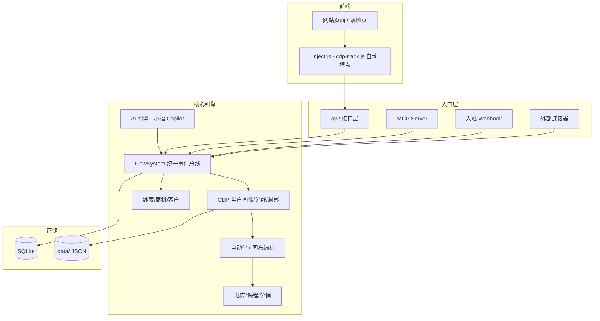
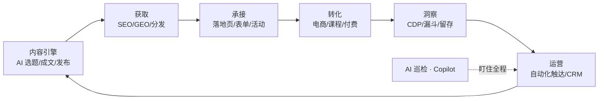

# OpenFlow XMP

> **AI 时代的网站增长操作系统 —— 让网站自己获得增长**

一个开箱即用的 PHP 单体应用：内容、SEO/GEO、用户数据（CDP）、营销自动化（MA）、CRM、电商、课程、社区，一个系统内打通。加上一个会主动干活的 AI 增长引擎。

**芭乐派**是主品牌（增长方法论 + 门派社区），**OpenFlow** 是它的开源底座。理论（方法论）→ 工具（平台）→ 落地（AI 增长引擎）三位一体，核心能力永久开源。

<div align="center">

  [](https://github.com/sevenaaaaaaaaa/openflow/actions)  

</div>

---

## 📌 产品定位

### 它是什么

OpenFlow 不是"又一个建站工具"，而是一套**增长操作系统**。它把网站的每一项能力——内容生产、搜索获取、用户洞察、自动化触达、交易转化——串成一个**自动运转的增长闭环**，让网站从"被动的展示页"升级为"自动获客的增长引擎"。

```
内容 → 获取 → 承接 → 转化 → 洞察 → 运营 → （回到内容）
```

每 6 小时，内置的 AI 增长引擎会自动爬热点、写草稿、做 SEO、盯转化、提醒运营动作——像一个**全年无休的增长团队成员**。

### 它不是什么

| ❌ 不是 | ✅ 而是 |
|---|---|
| 不是又一个大而全却难上手的 CMS | 30 分钟能上线，聚焦"增长"这一个目标 |
| 不是需要 MySQL/Redis/Node 的重型系统 | 纯 PHP + JSON + SQLite，零外部服务 |
| 不是 AI 套壳的营销噱头 | AI 真正驱动选稿、成文、洞察、巡检、自动化 |
| 不是把数据锁在云端的 SaaS | 数据 100% 在你的服务器本地 |

### 为谁而做

| 人群 | 用 OpenFlow 做什么 |
|---|---|
| **一人公司 / 超级个体** | 内容自动发布 + GEO 收录 + 课程/咨询线上转化 |
| **个人品牌 / 知识博主** | 文章、专栏、付费课程、会员、分销 一条龙 |
| **企业官网** | 落地页获客 + CRM 管道 + 自动化线索培育 |
| **SaaS / 产品站** | SEO 全家桶 + 转化漏斗 + CDP 用户画像 + A/B 测试 |
| **内容 / 社区站** | UGC 点评、专题聚合、多作者、活动报名 |
| **电商 / 品牌站** | 商品 + SKU 库存 + 促销 + 优惠券 + 三层分佣 |

### 核心理念

- **鱼与渔相济**：不只给你工具（鱼），更内置增长策略与方法论（渔）
- **TIPS 框架**：触达（Touch）· 洞察（Insight）· 个性化（Personalize）· 销售（Sell）四力合一
- **AI Agent 原生**：AI 不是按钮，是一个能规划、执行、盯结果的增长引擎

---

## 🖼 一图看懂

### 系统架构



### 增长闭环



---

## ✨ 为什么选 OpenFlow

| 维度 | 你的收益 |
|---|---|
| **一体化** | CMS + SEO/GEO + CDP + MA + CRM + 电商 + 课程 + 社区 + 活动 + 分销 全在一个系统，数据天然打通，**不用接 6 个 SaaS 再拼数据** |
| **AI Agent 原生** | 小福 Copilot 自然语言建自动化 · 漏斗 AI 巡检自动告警 · AI 一键生成落地页/文章 · MCP Server 开放给外部 AI |
| **数据闭环** | 采集 → Schema 校验 → 画像 → 分群 → 触达（频控）→ 转化 → CAPI 回传 → 投放归因，**全链路零断点** |
| **一方/三方数据** | 入站 Webhook 接收 + 外部连接器拉取 + CRM/订单/微信用户回填画像 |
| **开箱即用** | PHP 单体、零生产依赖、JSON + SQLite、Apache/Nginx/宝塔/Docker 都能跑，**30 分钟上线** |
| **数据主权** | 数据 100% 本地，不依赖任何外部服务；支持数据导出、注销、脱敏，符合个保法/GDPR |
| **开源 MIT** | 永久免费，可商用，可二次开发，可私有部署 |

---

## 🗺 能力地图

### 1. 内容引擎 + SEO/GEO
- AI 选题/成文（OpenAI / Claude / DeepSeek / MiniMax 多供应商）
- 批量发布 · 定时发布 · 内容日历 · 多平台分发（公众号/知乎/小红书/B站/视频号/抖音）
- SEO：301 · Sitemap · 结构化数据 · 页面级 SEO · 多语言 hreflang
- GEO：面向 AI 搜索引擎优化 · IndexNow 即时收录
- 知识库 RAG（飞书/Notion/印象笔记/Obsidian 双向同步）

### 2. 用户数据（CDP）
- 行为采集（页面/点击/滚动/表单/站外）· Tracking Plan 数据质量校验
- 用户画像 360°（匿名→登录→微信 openid 身份合并）· 行为时间线
- 标签 · 健康分/RFM · 规则分群（实时进出群）· 留存/漏斗/路径/营收
- 点击热力图 · 会话回放 · A/B 测试（Z 检验显著性）

### 3. 触达体系（MA/CRM）
- 营销自动化：15+ 触发器 × 邮件/延迟/通知/打标签/积分/发券/站内信 · 条件分支并行
- 可视化画布 · 邮件营销闭环（模板/退订/打开点击统计）· 跨渠道频控
- CRM：线索/商机/客户管道 · 查重防撞单 · 赢率预测 · 跟进任务
- 私域：公众号（群发/模板消息）· 企业微信（私信/群发）

### 4. 商业化
- 电商：SKU 库存 · 限时促销 · 优惠券 · 组合包 · 会员额度 · 三层分成
- 课程：多课时 · 测验（自动批改）· 笔记/评分 · 讲师/开发者发布 + 审核
- 活动：线上/线下 · 原生报名（名额/审核）· 开始前提醒 · 直播/回放
- 生态市场：Skill/插件/主题 · 开发者入驻 · 分销推广 + 排行榜

### 5. AI Agent 原生
- 小福 Copilot：自然语言 → 创建自动化流程 / 查询数据
- 转化漏斗 AI 巡检：落地页/渠道转化率骤降自动告警 + 根因建议
- AI 一键生成落地页 · AI 写文章（标题/slug/SEO 一次产出）
- MCP Server（HTTP/stdio，API Key 鉴权）

---

## 🧩 典型应用场景

### 场景一：内容博主，一个人做增长
> 你写好一篇行业洞察，OpenFlow 自动做 GEO/SEO、定时发布、推送到公众号/知乎，AI 生成下期选题，访客注册后自动进入"欢迎邮件 → 推荐阅读 → 课程转化"的自动化流程。

### 场景二：SaaS 官网，用数据驱动转化
> 埋点自动采集 → 用户画像与分群 → 热力图看哪里卡住 → A/B 测试改落地页 → 转化率骤降时 AI 巡检自动告警 → CAPI 回传广告平台优化投放。

### 场景三：知识付费，内容 + 课程 + 会员
> 文章引流 → 付费课程（含测验）→ 商品会员（年度/永久）→ 分销推广（佣金自动分账）→ 完课自动奖励积分/优惠券。

### 场景四：企业官网，线索培育
> 落地页表单 → CRM 线索 → 评分与查重 → 自动化跟进（延迟邮件 + 站内信）→ 转商机/客户 → 销售预测。

### 场景五：已有站点，渐进式接入
> 通过公开内容 API 让现有前端拉取内容渲染；SSO 共享登录；`/growth/` 子路径挂载；或整站迁移（内置数据迁移助手 + 6 类数据导入）。

---

## 🚀 30 分钟上手

### 1. 环境要求
- **PHP 8.0+**（推荐 8.2+），扩展：`gd` `pdo_sqlite` `mbstring` `fileinfo` `curl` `openssl`
- 任意 Web 服务器（Apache / Nginx / 宝塔 / Caddy），**无需 MySQL**
- 存储：JSON 文件 + SQLite，开箱即用

### 2. 安装

```bash
git clone https://github.com/sevenaaaaaaaaa/openflow.git
cd openflow

# 确保数据与上传目录可写
chmod -R 775 data uploads

# 用你的 Web 服务器指向项目根目录（Apache 用自带 .htaccess）
```

### 3. 初始化
1. 浏览器访问你的域名 → 进入后台 `/xmp`
2. 登录后台（默认管理员账号见后台登录页提示，首次登录请立即修改密码）
3. **设置 → 站点配置**：把 `site_url` 改为你的域名（默认占位 `example.com`）
4. **设置 → AI Agent**：配置大模型 Key（可选，AI 功能依赖；不配也能用，AI 部分自动降级）

### 4. 配置定时任务（cron）

```cron
* * * * *  curl -s https://你的域名/api/cron.php
```

cron 负责：定时发布 · 自动化队列 · 连接器同步 · 活动提醒 · 漏斗巡检 · 报表订阅 · 流失预警

### 5. 完成

> 📸 截图占位：`docs/screenshots/01-dashboard.png` · `02-cdp.png` · `03-automation.png` · `04-commerce.png`（目录已创建，欢迎 PR 补充真实截图）
>
> 🎬 视频演示：可在 [docs/video](docs/video/README.md) 放置演示视频链接（部署演示 / 功能 walkthrough）

---

## ⚙️ 部署适配

| 环境 | 方式 |
|---|---|
| **Apache** | 项目自带 `.htaccess`，开启 `mod_rewrite` 即可 |
| **Nginx** | 参照根目录 `nginx.site.conf`（含前台美化 URL 与 `/xmp/` 后台路由） |
| **宝塔面板** | 站点 → 伪静态 → 粘贴 `deploy/baota-rewrites.conf` |
| **Docker** | 纯 PHP 无框架 + JSON/SQLite，官方镜像与 Compose 即将提供（可用任意 PHP 镜像 + 数据卷） |
| **虚拟主机** | 纯 PHP 无框架，上传即用（需 PHP 8.0+ 与 SQLite 扩展） |
| **已有站点融合** | 公开内容 API（SSR）· SSO 统一登录 · `/growth/` 子路径挂载 |
| **多语言** | URL 前缀 `/en/ /ja/` · 语言切换器 · hreflang |

> 数据目录可用环境变量指定：`OF_DATA_DIR` / `OF_UPLOAD_DIR`（见 `.env.example`）

---

## 📈 下一步计划

> 完整路线图见 [md-docs/ROADMAP.md](md-docs/ROADMAP.md)

- **近期（P0）**：
  - GEO 话题 → 自动成文 → 自动提交一键流
  - 线索多来源去重合并 · 渠道数据回传画布节点
  - 会员到期自动降级提醒 · 课程/回放按权益解锁
  - Agent 工具调用（小福直接执行后台操作 + 操作确认）
  - 双因素认证（TOTP）· 权限细化到操作级
- **中期（P1）**：写作工作台 · 网站增长诊断报告 · 建议规则可配置
- **远期（P2）**：生长数据迁移 · 形态驱动前台排序 · 半自动修复扩展

---

## 📚 文档

- [功能清单](md-docs/FEATURES.md) · [使用说明（30 分钟上手）](md-docs/USAGE.md) · [架构规范](md-docs/ARCHITECTURE.md)
- [部署文档](md-docs/deployment.md) · [开发者](md-docs/DEVELOPER.md) · [变更日志](md-docs/CHANGELOG.md)

---

## 🛡 数据与隐私

- **数据 100% 本地**：`data/`（JSON + SQLite），不依赖任何外部服务
- **密钥不入库**：`.gitignore` 已排除 `data/`、`.env`、部署脚本
- **隐私合规**：用户可自助导出数据 / 注销账号 · 后台支持邮箱/手机号脱敏 · 埋点尊重 Do Not Track

---

## 参与贡献

- 🐛 提 Bug / 💡 提需求：GitHub Issues
- 🧩 提交修复：Fork + PR（CI 会自动跑 PHP 语法检查）
- 📝 补充截图/文档：`docs/` 目录随时欢迎
- 🌐 本地化翻译：语言包位于 `data/lang/`

## License

[MIT](LICENSE) · Copyright (c) 2026 芭乐派（OpenFlow XMP）
