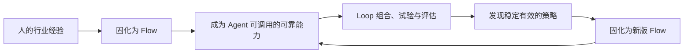

# OpenFlow

> 基于 TIPS，同时运行 Flow 与 Loop 的开源增长操作系统。

OpenFlow 把内容触达、用户洞察、个性化运营和销售增强放进同一个业务系统，帮助一人公司、创作者和小型组织，把零散的营销工具与运营动作连接成可以执行、衡量和持续改进的增长过程。

它提供两种边界清晰、长期并存的工作方式：

- **Flow 模式（AITIPS Copilot）**：人设计节点、画布和规则，AI 辅助搭建、检查与优化，系统按确定性流程稳定执行。
- **Loop 模式（TIPS Agent）**：人定义目标、资源和边界，Agent 基于 TIPS 调用模型、Skills、Harness 与已有 Flow，在受控循环中观察、行动、评估和调整。

两者没有高低之分。已知怎么做，用 Flow；知道想要什么、但缺少经验或人力时，用 Loop。成熟的 Flow 可以成为 Loop 的可靠能力，经过验证的 Loop 也可以固化为新的 Flow。

OpenFlow 使用 PHP 8 + JSON/SQLite，默认不依赖 MySQL、Redis 或 Node；数据保留在自己的服务器上。项目采用 MIT License，可私有部署、二次开发和商用。

---

## 为什么是 OpenFlow

多数增长工具默认背后有内容、数据、营销和销售团队。一个人把这些工具全部买齐，得到的往往不是一支团队，而是一组仍然需要自己配置、维护和操作的系统。

OpenFlow 解决两个互补问题：

1. **把已知方法稳定执行**：用 Flow 将人的经验沉淀为可复用、可审计的确定性流程。
2. **弥补经验与人力不足**：用 Loop 让 TIPS Agent 在明确护栏内组合能力、验证策略并持续优化。

系统的重要性不在于用了多少 AI，而在于能否可靠地服务业务。AI 不可用时，内容、客户、自动化、订单等基础业务仍然可以运行；任何涉及发布、群发、价格、支付、退款、删除或外部写入的高风险动作，都应继续接受权限、审批、预算、频控和审计约束。

---

## TIPS：共同的业务模型

Flow 与 Loop 共享同一套 TIPS 业务模型、数据和执行能力。

| TIPS | 解决的问题 | 当前主要能力 |
|---|---|---|
| **Touch · 用户触达** | 如何让正确的人发现并进入业务 | CMS、CPT、SEO/GEO、知识库、落地页、表单、内容日历、多语言、分发 |
| **Insight · 用户洞察** | 谁来了、做了什么、为什么转化 | CDP、匿名与会员合并、事件采集、分群、RFM、漏斗、路径、归因、A/B 测试、问数据 |
| **Personalize · 个性化运营** | 对不同的人，在什么时机采取什么动作 | 动态内容、区块定向、营销画布、邮件与站内触达、频控、人群激活、Campaign |
| **Sell · 销售增强** | 如何把意向变成收入并让真相回流 | CRM、统一收件箱、销售建议、报价、订单、支付、课程、会员、分销、复购 |

TIPS 不是四个相互独立的功能区，而是一条带反馈的增长回路：


任何完整的增长策略都应该说明：触达谁、依据什么判断、如何差异化运营、怎样产生商业结果，以及结果如何进入下一轮判断。

---

## 两种运行范式

### Flow 模式 · AITIPS Copilot

Flow 的核心是：**人掌握策略，AI 辅助设计，系统稳定执行。**

```text
人的经验 → 节点与画布 → 条件、动作和分支 → 确定性执行 → 人复盘并修改
```

AI 在 Flow 中是 Copilot，可以帮助：

- 用自然语言生成流程草稿；
- 推荐触发器、条件、人群和动作；
- 检查空分支、冲突、频控和风险；
- 生成内容、邮件、销售话术与物料；
- 解释流程表现并提出优化建议。

最终策略、流程版本和关键业务动作仍由人决定。Flow 适合已经有方法论和 SOP 的高阶用户，也适合交易、交付、通知等强调确定性、稳定性和合规性的业务。

### Loop 模式 · TIPS Agent

Loop 的核心是：**人定义意图与边界，Agent 在 TIPS 内寻找、执行和优化路径。**


Loop 不是无限调用大模型，也不是让通用 AI 自由接管营销。一个可靠的业务 Loop 至少需要：

- **Goal**：明确目标、周期、成功指标和成本边界；
- **State**：从真实内容、画像、行为、成交和历史行动读取状态；
- **Skills**：调用有清晰输入、输出和权限声明的业务能力；
- **Harness**：限制工具、步骤、模型成本、超时和失败处理；
- **Policy**：执行权限、同意、隐私、频控、预算和品牌规则；
- **Evaluation**：用业务结果而不是模型自评判断是否有效；
- **Memory**：记住做过什么、结果如何以及用户怎样纠正；
- **Stop Conditions**：达到目标、超过预算、证据不足或出现风险时停止。

Loop 适合目标明确但路径未知、需要跨 TIPS 动态协调，或者缺少专职增长经验与人力的场景。

### Flow 与 Loop 如何互相增强



OpenFlow 长期积累的不是一次性对话，而是三类可交付资产：

- 官方维护的基础 Flow 与 Skills；
- 用户和 Agent 共同打磨的专属增长 Loop；
- 经验证后可分享、可安装的行业工作流。

---

## 当前已经具备什么

项目已经完成大部分业务器官和第一阶段连接工作，当前代码包含约 195 个后台入口、93 个 API 端点和 165 个核心模块。数量会随开发变化，以下以能力边界为准。

### 业务底座

- 内容、页面、CPT、多语言版本、全文搜索、知识库与可复用内容块；
- CDP 画像、事件存储、匿名身份合并、分群、归因与人群激活；
- 营销自动化画布、条件与动作库、动态内容、触达与频控；
- CRM、统一会话、报价、订单、支付、课程、会员、分销与结算；
- 角色权限、同意管理、审计、2FA、备份恢复与多租户基础。

### AI 与增长大脑基础

- 多模型统一入口、调用计量、预算限制、分档超时和降级；
- 基于画像、成交真相和目标的下一最佳动作建议；
- 共享增长目标、跨模块记忆、决策轨迹和人工采纳箱；
- 文章发布进入知识库，成交信息回流 CDP 与增长判断；
- AI 个性化、问数据、内容生成、销售话术和站点问答；
- 自我体检从错误、404、性能等信号生成改进清单；确定性补丁必须由人审核后才能应用。

### 开放与扩展

- 插件系统和跨内容、CDP、CRM、自动化、SEO、支付的 hooks；
- prompt、tool、workflow 类型的 Skills 与生成物安全检查；
- MCP Server，允许外部 Agent 在权限与审计约束下读取或操作站点；
- 通用连接器、Webhook、OAuth2、可分享连接模板与加密凭据存储；
- 临时外部协作、按对象授权、修订记录、差异查看与恢复。

### 工程与演进基础

- 默认使用 JSON + SQLite，高频事件可选切换 MySQL；
- 事件追加写、批量写、索引和多租户数据目录已经建立；
- 关键跨存储写操作具备事务与回滚能力；
- 公开 AI 端点具有鉴权或限流，模型不可用时业务可降级；
- 契约测试覆盖权限、可靠性、数据写入、增长大脑、MCP 和主要页面。

### 当前边界

OpenFlow 已经有 Loop 所需的部分地基，但完整的 TIPS Agent 运行时仍在建设中：

- 当前“增长大脑”以可解释的规则型建议为主，不等同于自主策略 Agent；
- 当前“采纳”主要生成带上下文的待办或进入现有业务模块，不等同于端到端自动执行；
- Skills、Flow、记忆、目标和评估已经存在，但尚未统一为完整的 Loop 生命周期；
- 联邦智能、多租户平台化等能力目前主要是基础设施，不代表已经形成规模化网络效应；
- AI 能力取决于用户配置的模型与预算；不配置 AI 时，确定性业务能力仍可使用。

我们会明确区分**已实现、已接入真实路径、已被使用、已验证有效**，不会把远景写成现状。

---

## 典型工作方式

### 用 Flow 稳定执行已知方法

一名成熟运营人员可以建立：

```text
提交咨询表单
→ 判断客户类型与意向
→ 发送对应资料
→ 创建销售跟进任务
→ 超时未跟进则提醒
→ 成交或丢单结果回流洞察
```

Copilot 帮助检查流程、补充条件和生成内容，但系统严格按照批准的 Flow 执行。

### 用 Loop 打磨未知路径

一名创作者可以提出：

> 在不增加群发频率的前提下，本月获得 20 个付费咨询客户。

TIPS Agent 可以在护栏内：

1. 从内容、渠道、画像和成交记录读取真实状态；
2. 按 Touch、Insight、Personalize、Sell 制订完整策略；
3. 调用已有 Flow 和 Skills 准备内容、人群、触达与销售动作；
4. 对发布、群发、报价等关键节点请求审批；
5. 运行小范围实验，评估线索、成交、成本和负面信号；
6. 保留有效方法、停止无效动作，并提出下一轮版本；
7. 多轮稳定后，把方法固化为可重复运行的专属 Flow。

---

## 安装与运行

### 环境要求

- PHP 8.0+，推荐 PHP 8.2+；
- `gd`、`pdo_sqlite`、`mbstring`、`fileinfo`、`curl`、`openssl` 扩展；
- Apache、Nginx、Caddy 或其他支持 PHP 的 Web 服务器；
- `data/` 以及实际上传目录需要对 Web 进程可写。

### 安装

```bash
git clone https://github.com/sevenaaaaaaaaa/openflow.git
cd openflow
composer install --no-dev --optimize-autoloader
```

将 Web 根目录指向项目目录，Apache 可使用仓库中的 `.htaccess`，Nginx 可参考 `nginx.site.conf`。随后访问站点，根据安装向导完成管理员、站点地址和基础配置。

AI 是可选能力。未配置模型时，OpenFlow 仍可作为完整的内容、数据、自动化和商业系统使用，相关 AI 功能会明确降级。

### 定时任务

```cron
* * * * * curl -fsS https://你的域名/api/cron.php >/dev/null 2>&1
```

实际周期由用户自己的 cron 配置决定。定时任务负责处理定时发布、自动化队列、同步、提醒和报告等后台工作。

更完整的部署、备份和恢复说明见：

- [部署文档](md-docs/deployment.md)
- [备份与恢复](md-docs/backup-restore.md)
- [使用说明](md-docs/USAGE.md)

---

## 开发原则

1. **业务优先**：AI、交互和架构必须服务于可衡量的业务结果。
2. **TIPS 不变**：Flow 与 Loop 共用同一业务模型，不另造一套模糊框架。
3. **双范式并存**：Flow 不被 Loop 淘汰，Loop 不退化成 Flow 上的聊天按钮。
4. **单一事实源**：两种模式共享数据、权限、审计和领域能力，不复制业务实现。
5. **确定性下沉**：可靠动作固化为 Flow 或 Skill，不让模型每次重新发明。
6. **策略可组合，执行有边界**：Agent 可以组合能力，但不能绕过权限、同意、频控、预算和审批。
7. **渐进自治**：从建议、到协作、再到有限托管；高风险动作始终保留人工闸门。
8. **失败可恢复**：模型、渠道或连接器故障不能拖垮核心业务，所有关键动作可追踪、可暂停、可回滚。
9. **兼容优先**：默认轻量部署，按真实规模信号升级存储和运行方式。
10. **用结果学习**：Loop 依靠真实业务反馈改进，不以模型自评代替效果验证。

---

## 路线与未来远景

### 近期：建立双工作台与统一契约

- 保留并完善现有 AITIPS Flow 工作台；
- 建立独立但互通的 TIPS Agent Loop 工作台；
- 统一 Goal、Flow、Skill、Action、Run、Evaluation、Memory 等核心对象；
- 让 Agent 生成的任何动作都能在专业模式中查看、接管和修改；
- 让成熟 Flow 可以被 Agent 当作可靠 Skill 调用；
- 先以建议和人工审批为默认，不改变现有业务执行方式。

### 中期：跑通第一个完整增长 Loop

优先选择“高意向线索到成交”作为验证路径：

```text
识别高意向用户
→ 形成证据与分群
→ 准备差异化培育
→ 生成销售跟进与报价
→ 人工审批并执行
→ 记录成交、丢单和成本
→ 调整下一轮策略
```

完整 Loop 必须经过草拟、沙盘、陪跑、稳定、托管五个阶段。只有多轮产生稳定结果、风险和成本可控的策略，才允许固化或提高自治程度。

### 长期：让经验在 Flow 与 Loop 之间复利

未来的 OpenFlow 将形成一套可持续积累的增长资产系统：

- 人的经验被沉淀为确定性 Flow；
- Flow 成为 Agent 可以信赖的业务能力；
- Loop 组合能力、运行小实验并依据结果调整；
- 稳定有效的 Loop 被固化为新 Flow；
- 专属工作流经过脱敏和授权后，可以成为行业模板或生态资产。

最终目标不是让 AI 取代人，也不是让用户学习更多工具，而是让每个组织拥有一套属于自己的、可解释、可接管、可稳定交付并持续进化的增长工作流。

---

## 文档

- [文档导读](docs/README.md)
- [产品北极星](docs/VISION.md)
- [跨模块审计](docs/AUDIT-07-SYNTHESIS.md)
- [技术演进路线](docs/ROADMAP.md)
- [规模演进](docs/EVOLUTION.md)
- [架构规范](md-docs/ARCHITECTURE.md)
- [开发者文档](md-docs/DEVELOPER.md)
- [变更日志](md-docs/CHANGELOG.md)

---

## License

[MIT](LICENSE)
