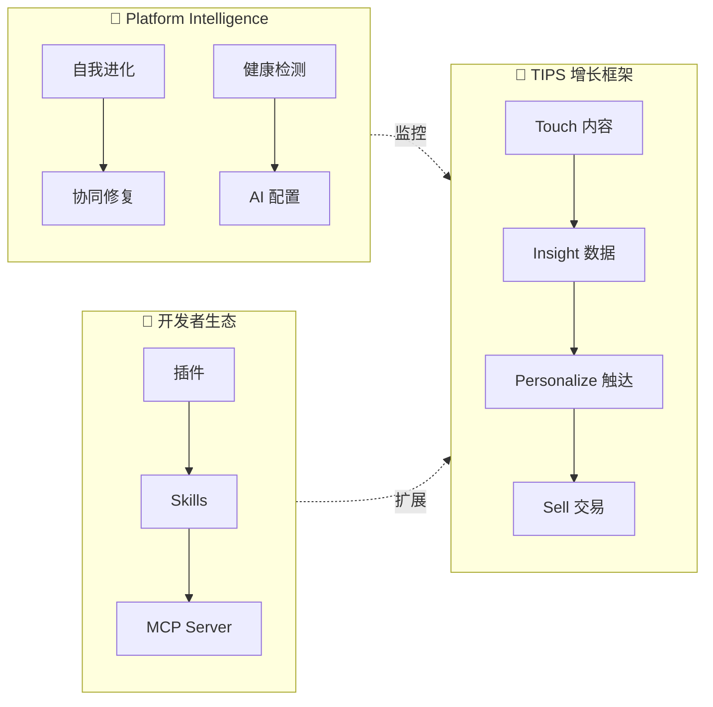
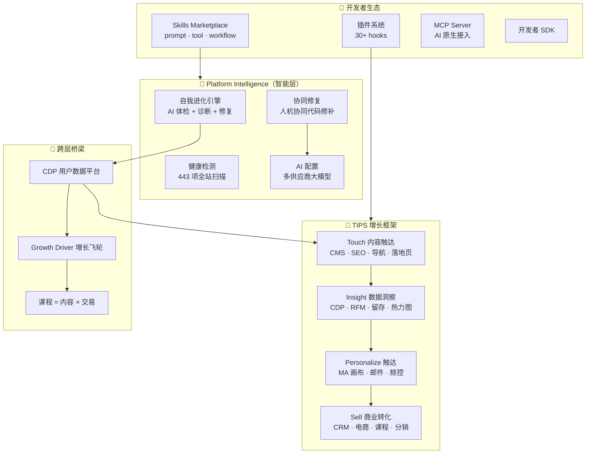
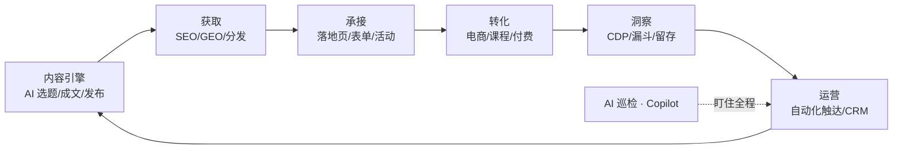
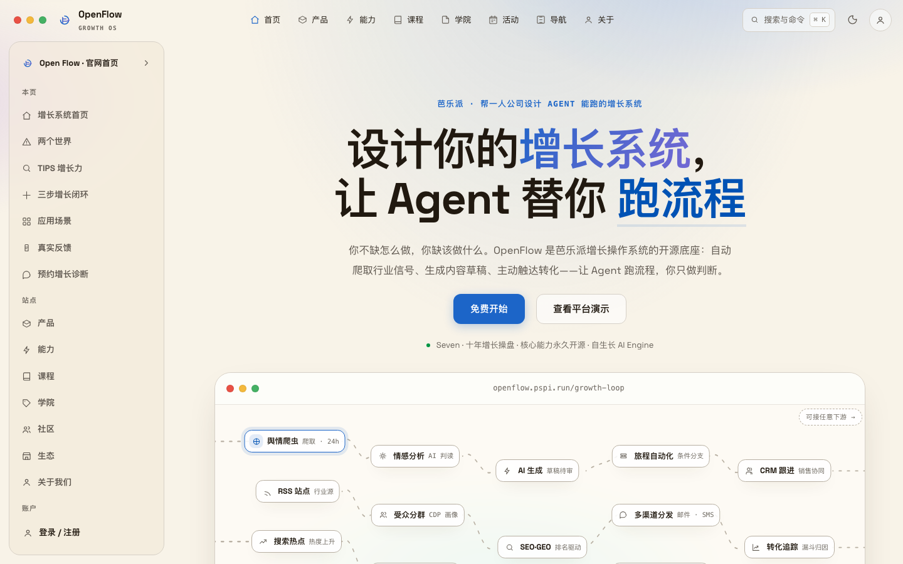

# OpenFlow XMP

> **AI 时代的网站增长操作系统 —— 让网站自己获得增长**

一个开箱即用的 PHP 单体应用：内容、SEO/GEO、用户数据（CDP）、营销自动化（MA）、CRM、电商、课程、社区，一个系统内打通。加上一个会主动干活的 AI 增长引擎。

**芭乐派**是主品牌（增长方法论 + 门派社区），**OpenFlow** 是它的开源底座。理论（方法论）→ 工具（平台）→ 落地（AI 增长引擎）三位一体，核心能力永久开源。

<div align="center">

  [](https://github.com/sevenaaaaaaaaa/openflow/actions)  

</div>

---

## 📌 产品定位

### 它是什么

OpenFlow 不是"又一个建站工具"，而是一套**增长操作系统**。它把网站的每一项能力——内容生产、搜索获取、用户洞察、自动化触达、交易转化——串成一个**自动运转的增长闭环**，让网站从"被动的展示页"升级为"自动获客的增长引擎"。

更独特的是，OpenFlow 内置了 **Platform Intelligence（平台智能层）**——系统能自动体检、诊断问题、建议修复方案、甚至帮你自动修。这是市面上**唯一一个有自我进化能力的增长系统**。



每 6 小时，内置的 AI 增长引擎会自动爬热点、写草稿、做 SEO、盯转化、提醒运营动作——像一个**全年无休的增长团队成员**。

### 它不是什么

| ❌ 不是 | ✅ 而是 |
|---|---|
| 不是又一个大而全却难上手的 CMS | 30 分钟能上线，聚焦"增长"这一个目标 |
| 不是需要 MySQL/Redis/Node 的重型系统 | 纯 PHP + JSON + SQLite，零外部服务 |
| 不是 AI 套壳的营销噱头 | AI 真正驱动选稿、成文、洞察、巡检、自动化 |
| 不是把数据锁在云端的 SaaS | 数据 100% 在你的服务器本地 |

### 为谁而做

| 人群 | 用 OpenFlow 做什么 |
|---|---|
| **一人公司 / 超级个体** | 内容自动发布 + GEO 收录 + 课程/咨询线上转化 |
| **个人品牌 / 知识博主** | 文章、专栏、付费课程、会员、分销 一条龙 |
| **企业官网** | 落地页获客 + CRM 管道 + 自动化线索培育 |
| **SaaS / 产品站** | SEO 全家桶 + 转化漏斗 + CDP 用户画像 + A/B 测试 |
| **内容 / 社区站** | UGC 点评、专题聚合、多作者、活动报名 |
| **电商 / 品牌站** | 商品 + SKU 库存 + 促销 + 优惠券 + 三层分佣 |

### 核心理念

- **鱼与渔相济**：不只给你工具（鱼），更内置增长策略与方法论（渔）
- **TIPS 框架**：触达（Touch）· 洞察（Insight）· 个性化（Personalize）· 销售（Sell）四力合一
- **AI Agent 原生**：AI 不是按钮，是一个能规划、执行、盯结果的增长引擎

### 内容观：内容不是页面，是活的知识与销售系统

现有 CMS 假设「内容是人写给人看的页面」，发布即终点。我们不这么看。

> **别人的 CMS 帮你发布页面给人看；OpenFlow 把内容变成一个活的、懂访客、
> 会自己达成目标、还能被 AI 直接调用的知识与销售系统。**

支撑这句话的，是三样别人没有、而我们焊在一起的零件——**CDP 实时画像、
常驻 AI 增长引擎、MCP/知识底座**。由此，内容围绕三条轴重建，而非围绕
「编辑一个文档」：

- **谁生产**：AI 辅助人工创作（大纲/配图/视频转图文教程）、面向 AI 的纯 AI
  内容（答案版 MD、自动结构化数据、面向 Agent 的可执行标记）、人辅助 AI 的
  全新内容（人掌过程与把关、AI 掌知识、强制接地不发无源断言）。
- **给谁消费**：每条内容双重发布——**人看的页面 + 机器读的结构**，后者进
  MCP 知识 API，让内容不只可被 AI 引用，还可被 Agent 执行（一段「预约咨询」
  即一个可调用的收款/留资动作）。
- **人把关多少**：来源与把关等级是内容的一等字段，既管质量，也作为被 AI
  搜索采信、合规标注的信任信号。

内容发布后天然接上 CDP 画像 → 个性化投放 → 成交（收款链接），
「这篇内容带来多少线索、多少成交」是内容的一等指标。
> 详见 `docs/AUDIT-01-CONTENT.md`（深度对标 + 创新方向）与 `docs/VISION.md`。

### 数据观：轻量集成 + AI 闭环，不重造 BI/数仓

常有人问：采集、报表、分层、画像、触达，我自己带着工程师就能搭，何必用 CDP？
老 CDP 的错，是把自己做成「统一数据 + 自建一整套分析」，和 BI/数仓正面重叠——
有团队的觉得重复，论深度又打不过专业 BI。**我们换战场**：

> **不与 BI/数仓卷分析深度**；不可替代的价值是「**闭环速度 × 无团队**」——
> 用自然语言 + AI Agent，让一个请不起工程师/分析师的人，也能几分钟内
> 拿到自定义报表、搭出驾驶舱、得到洞察、并直接连 MA 把策略落地。

对有成熟数据团队的大厂，这可能重复，那不是我们的战场；对一人公司 / 超级
个体 / 无团队组织，这条「AI 替你跑完 数据→洞察→策略→落地 整条链」的路，
恰恰是**唯一可行**。全线同理：内容不卷 Webflow 的像素自由、Sales 不卷
Salesforce 的配置深度——我们卷的永远是「无团队也能几分钟闭环」。
> 详见 `docs/AUDIT-02-CDP.md` 与 `docs/VISION.md`。

### 个性化观：自动化不是核心，个性化才是——而个性化最需要 Agent

营销自动化（可视化画布/流程）只解决**转化效率**——把重复触达自动跑起来，
对一千个人做的还是同几套预设。**真正提升转化率的是个性化**：千人千面地对的人、
在对的时刻、说对的话、给对的东西。个性化过去做不透，卡在两点——**策略依赖
人的经验、画布要一个节点一个节点配、门槛极高**。而这恰是**人一定不如 Agent**
的事。

> 所以「AI Agent 时代原生」的真义，不是给老画布加个 AI 按钮，而是让 Agent
> 站到决策位：**别人的 MA 是「你画一张流程图，系统照着跑」；OpenFlow 是
> 「你定一个目标，Agent 替你千人千面地把它跑成」。**

HubSpot/Braze 的核心资产就是那张画布，Agent 直接决策会掏空它，所以它们只能
外挂 AI；我们围绕 CDP + AI 引擎 + MCP 新建，没有这个包袱，可以原生。个性化
（内容生成）× CDP（实时上下文）× Sales（成交动作）× MA（逐人决策）本就是
同一个**增长大脑**的四个器官。
> 详见 `docs/AUDIT-03-MA.md` 与 `docs/VISION.md`。

### 销售观：不做更好用的记录本，做会回流、会行动的成交器官

传统 CRM 的原罪是「记录系统」——人录信息、人去看、人去判断、人去行动，
数据录进去就死在记录里。AI-native 的 Sales 不该是「更好用的记录本」，
而该做两件现有 CRM **结构上**做不到的事：① 把 Sales 变成增长大脑的**双向节点**——
CRM 是全公司离钱最近的真相来源，成交/丢单信号**反哺 CDP/MA/Content**，
给出营销动作需求，从此 Sales 不是「消费线索的终点」，是「给全系统供真相的源头」；
② 让 **Agent 当那个不存在的销售经理/教练**——实时汇总所有销售进度，
基于全局给管理者与销售各自的下一步动作，连物料和话术都备好，
补上「个人销售与管理者之间没有数据共鸣」的空白。

> 客服也不做传统工单系统，用**会卖的站点 Agent** 补：从本站内容现答、带画像、
> 答完顺势成交、搞不定转人工并落一条 CRM 线索——把客服从成本中心变成收入触点。
> 详见 `docs/AUDIT-04-SALES.md`。

### 平台观：电商不是又一个货架，是可以下放给每个创作者的增长引擎

「电商」有两张脸：**单商户卖货**（一个人卖自己的课程/内容/服务，交易水管已够用）
与**双边平台运营**（skills/插件/主题/课程/付费内容来自多个创作者，平台居中撮合、
抽成、治理、赋能）。后者是当下最大的坑——交易的水管铺好了，却缺一个**平台层**
真正经营生意：无统一商品目录、无运营台、无创作者赋能、无商品营销引擎。

> 但真正的机会不是补一个应用商店。在位的创作者平台（App Store / Whop / Teachable）
> 本质是「更好的货架 + 结算」——只撮合交易，**不为每个创作者的增长负责**。
> 而 OpenFlow 本身就是一台增长引擎，**把它多租户化下放，就得到别人给不了的平台：
> 让每个上架的创作者都自动获得一支 AI 增长团队**（自己的买家画像、Agent 给的
> 选题/定价/复购建议、平台级的千人千面分发）。Agent 同时顶上创作者缺的增长团队、
> 平台缺的运营总监、以及把每个商品送到对的人面前的决策位——同一个增长大脑，
> 从服务一个站长，复制成服务一群创作者。详见 `docs/AUDIT-05-COMMERCE.md`。

### 生态观：OIA（One is All）—— 一次参与，同时是开发者/创作者/作者

在位生态把「参与」分开设三道墙：**开发者门槛太高**（要会写代码）、
**创作者太重**（要持续产出、自己涨粉）、**作者太高端**（署名出版那一套，
离生产和营销太远）。每道墙都把「参与」挡在「生产/营销」之外。

> **OpenFlow 的破壁点是 OIA：只要你参与，你就同时是开发者、创作者、作者——
> 一次加入，全平台赋能。** 你写的内容同时是知识、是能被 Agent 调用的技能、
> 是能上架卖的商品；你有个想法，AI（`SkillGenerator` 已能从一句描述生成
> skill/plugin）帮你把它变成工具；你做的任何东西，平台的增长大脑自动帮你
> 分发、营销、变现。四拆：合三身份为一个「参与者」、把开发降到描述（人人是
> 开发者）、一次贡献全平台赋能（拆掉离营销太远的墙）、贡献即复利（越多人参与、
> 每个人被赋能越强的正反馈飞轮）。详见 `docs/AUDIT-06-ECOSYSTEM.md`。

这不是口号，是「AI 抹平生产门槛」的必然产物——**谁先拆墙，谁就拿到零门槛
参与的生态**。至此产品的野心清晰了：不是又一个建站 / 电商工具，而是**一台懂
每个人、会判断、会行动、能下放给无数人、且越多人用越强的增长引擎**。

---

## 🖼 一图看懂

### 系统架构



### 增长闭环



---

## ✨ 为什么选 OpenFlow

| 维度 | 你的收益 |
|---|---|
| **平台智能** | **唯一一个内置自我进化能力的增长系统**——AI 体检、诊断修复、协同修补、健康评分，系统越用越聪明 |
| **一体化** | CMS + SEO/GEO + CDP + MA + CRM + 电商 + 课程 + 社区 + 活动 + 分销 + **11 语言 i18n + Notion 同步** 全在一个系统，数据天然打通 |
| **AI Agent 原生** | 小福 Copilot 自然语言建自动化 · 漏斗 AI 巡检自动告警 · AI 一键生成落地页/文章 · MCP Server 开放给外部 AI |
| **数据闭环** | CDP 全域画像 → RFM 分层 → 营销画布 → 转化归因 → 自动优化，**TIPS 四力合一** |
| **开发者生态** | 插件系统（30+ hooks）· Skills Marketplace · MCP Server · 开发者 SDK，**基于 TIPS 构建扩展** |
| **全球可达** | 11 语言国际化 · Cloudflare 全栈加速 · R2 全球边缘存储 · 国内外一致体验 |
| **数据主权** | 数据 100% 本地，不依赖外部服务；支持导出/注销/脱敏，符合个保法/GDPR |
| **开源 MIT** | 永久免费，可商用，可二次开发，可私有部署 |

---

## 🗺 能力地图

### 0. Platform Intelligence（平台智能 — 市面独一无二）

> 系统自带的"自我进化层"——不是业务功能，而是让整个平台越用越聪明的底层能力。

- **自我进化引擎**：AI 自动体检（错误/404/空数据/性能）→ 迭代建议 → 价值排序 → 人机协同修复
- **协同修复**：生成补丁 → 人工确认 → 应用 → 回滚（绝不自动改代码）
- **健康检测**：443 项全站扫描 + 评分 + URL 巡检（自动检测死链/403/404/5xx）
- **AI 配置**：多供应商（OpenAI / Claude / DeepSeek / MiniMax）统一配置
- **生长数据**：行为信号 → 形态画像 → 个性权重 → 周期报告

### 1. Touch（内容触达）
- AI 选题/成文（多供应商）· 批量发布 · 定时发布 · 内容日历 · 多平台分发
- SEO：301 · Sitemap · 结构化数据 · GEO/IndexNow · 页面级 SEO
- 知识库 RAG（飞书/Notion/Obsidian 双向同步）· Notion 全内容双向同步
- 导航站（417 站 · 9 分类 · 搜索/筛选/推荐）· 落地页生成器
- 课程体系 · 播客/视频 · 下载资源 · 活动管理

### 2. Insight（数据洞察）
- CDP 用户画像 360°（匿名→登录→微信 openid 合并）· 行为时间线
- RFM 分层 · 规则分群（实时进出群）· 留存/漏斗/路径/营收分析
- 点击热力图 · 会话回放 · A/B 测试（Z 检验显著性）
- 营销洞察（AI 自动生成）· 用户行为风控 · 舆情监测
- 问卷/NPS · 数据导出 · 翻译管理后台

### 3. Personalize（营销触达）
- 营销自动化画布：15+ 触发器 × 条件分支 × 多渠道（邮件/站内信/积分/优惠券）
- 邮件营销闭环（模板/退订/打开点击统计）· 跨渠道频控
- 动态内容引擎 · 转化组件 · 弹窗 A/B
- 表单构建器 · 二维码 · UTM 参数

### 4. Sell（商业转化）
- CRM 管道（漏斗/预测/ARR/查重/AI 评分）· 客户生命周期管理
- 电商：SKU · 促销 · 优惠券 · 三层分成 · 虎皮椒支付（微信/支付宝）
- 课程：多课时 · 测验 · 笔记 · 讲师发布 + 审核 · 会员体系
- 活动：线上/线下 · 原生报名 · 直播/回放 · 咨询预约
- 分销：推广员 · 佣金 · 提现 · 排行榜

### 5. 开发者生态
- **插件系统**：30+ hooks（CDP/CRM/MA/内容/SEO/支付全覆盖），GitHub 一键安装
- **Skills Marketplace**：prompt / tool / workflow 三种类型，公开 API
- **MCP Server**：10 个 AI 工具（stdio + HTTP），AI Agent 原生接入
- **开发者 SDK**：数据访问 / UI 注入 / 配置管理 / 日志

---

## 🧩 典型应用场景

### 场景一：内容博主，一个人做增长
> 你写好一篇行业洞察，OpenFlow 自动做 GEO/SEO、定时发布、推送到公众号/知乎，AI 生成下期选题，访客注册后自动进入"欢迎邮件 → 推荐阅读 → 课程转化"的自动化流程。

### 场景二：SaaS 官网，用数据驱动转化
> 埋点自动采集 → 用户画像与分群 → 热力图看哪里卡住 → A/B 测试改落地页 → 转化率骤降时 AI 巡检自动告警 → CAPI 回传广告平台优化投放。

### 场景三：知识付费，内容 + 课程 + 会员
> 文章引流 → 付费课程（含测验）→ 商品会员（年度/永久）→ 分销推广（佣金自动分账）→ 完课自动奖励积分/优惠券。

### 场景四：企业官网，线索培育
> 落地页表单 → CRM 线索 → 评分与查重 → 自动化跟进（延迟邮件 + 站内信）→ 转商机/客户 → 销售预测。

### 场景五：已有站点，渐进式接入
> 通过公开内容 API 让现有前端拉取内容渲染；SSO 共享登录；`/growth/` 子路径挂载；或整站迁移（内置数据迁移助手 + 6 类数据导入）。

---

## 🚀 30 分钟上手

### 1. 环境要求
- **PHP 8.0+**（推荐 8.2+），扩展：`gd` `pdo_sqlite` `mbstring` `fileinfo` `curl` `openssl`
- 任意 Web 服务器（Apache / Nginx / 宝塔 / Caddy），**无需 MySQL**
- 存储：JSON 文件 + SQLite，开箱即用

### 2. 安装

```bash
git clone https://github.com/sevenaaaaaaaaa/openflow.git
cd openflow

# 确保数据与上传目录可写
chmod -R 775 data uploads

# 用你的 Web 服务器指向项目根目录（Apache 用自带 .htaccess）
```

### 3. 初始化
1. 浏览器访问你的域名 → 进入后台 `/xmp`
2. 登录后台（默认管理员账号见后台登录页提示，首次登录请立即修改密码）
3. **设置 → 站点配置**：把 `site_url` 改为你的域名（默认占位 `example.com`）
4. **设置 → AI Agent**：配置大模型 Key（可选，AI 功能依赖；不配也能用，AI 部分自动降级）

### 4. 配置定时任务（cron）

```cron
* * * * *  curl -s https://你的域名/api/cron.php
```

cron 负责：定时发布 · 自动化队列 · 连接器同步 · 活动提醒 · 漏斗巡检 · 报表订阅 · 流失预警

### 5. 完成 🎉

至此，一个自带内容、用户数据、自动化触达与商业转化的网站已上线。

> 💡 **生产加速提示**：域名接入 Cloudflare（免费），后台「Cloudflare」页一键创建 Cache Rules，匿名访客 HTML 从边缘节点返回（TTFB ~0.4s），国内用户无需 VPN 也能快速访问。

### 🖼 界面预览

> 后台各模块实拍（点击放大）。更多见 [docs/screenshots](docs/screenshots/README.md)。

<p align="center">
  
  
</p>
<p align="center">
  
  
</p>
<p align="center">
  
  
</p>

> 🎬 视频演示：可在 [docs/video](docs/video/README.md) 放置演示视频链接（部署演示 / 功能 walkthrough）

---

## 🚀 部署方案

OpenFlow 是纯 PHP + JSON/SQLite 单体，**零外部服务依赖**，几乎可在任何能跑 PHP 的环境运行。下面覆盖从自建服务器到云主机、NAS 与 Serverless 的完整部署路径。

> **Cloudflare 加速推荐**：域名接入 Cloudflare（免费），配合 Workers + R2 + Cache Rules 可实现全球边缘加速（HTML/静态资源/API 均从边缘返回），详见后台 `/xmp/cloudflare` 管理页。

> 通用前提：PHP 8.0+（推荐 8.2+），扩展 `gd` `pdo_sqlite` `mbstring` `fileinfo` `curl` `openssl`；数据目录 `data/`、`uploads/` 可写。

### 1️⃣ Apache / Nginx（通用自建服务器）

```bash
git clone https://github.com/sevenaaaaaaaaa/openflow.git /var/www/openflow
chmod -R 775 /var/www/openflow/data /var/www/openflow/uploads
```

- **Apache**：开启 `mod_rewrite`，站点根指向项目目录（自带 `.htaccess`）
- **Nginx**：参照根目录 `nginx.site.conf`（含前台美化 URL 与 `/xmp/` 后台路由），PHP-FPM 处理 `*.php`
- 配置 cron：`* * * * * curl -s https://你的域名/api/cron.php`

### 2️⃣ Docker（容器化）

系统是无框架单体，任意 `php:8.2-apache` 或 `php:8.2-fpm` 镜像即可运行，**数据用卷持久化**：

```yaml
# docker-compose.yml
services:
  openflow:
    image: php:8.2-apache
    volumes:
      - ./openflow:/var/www/html
      - ./data:/var/www/html/data      # 数据卷（JSON + SQLite）
      - ./uploads:/var/www/html/uploads
    ports: ["8080:80"]
    environment:
      - OF_DATA_DIR=/var/www/html/data
      - OF_UPLOAD_DIR=/var/www/html/uploads
  cron:                              # 定时任务容器
    image: curlimages/curl:latest
    entrypoint: ["/bin/sh","-c","while true; do curl -s http://openflow/api/cron.php; sleep 300; done"]
    depends_on: [openflow]
```

> 官方镜像与一键 Compose 正在整理，后续会放入 `deploy/docker/`。

### 3️⃣ 宝塔面板（最省心，国内推荐）

1. 软件商店安装 **LNMP**（Nginx + PHP 8.2 + 无需 MySQL）
2. 添加站点 → 上传代码 / Git 拉取到站点目录
3. **PHP 设置**：启用扩展 `gd` `pdo_sqlite` `mbstring` `fileinfo` `curl` `openssl`
4. **伪静态**：粘贴 `deploy/baota-rewrites.conf` 内容
5. **计划任务**（Shell 脚本）：`curl -s https://你的域名/api/cron.php`，每 1 分钟
6. 站点目录权限 `www:www`，`data`/`uploads` 可写

### 4️⃣ 飞牛 OS（fnOS）/ 绿联 UGREEN（NAS）

两台 NAS 均内置 Docker / Docker Compose：

1. 应用中心 / Docker → 新建项目（Compose）
2. 粘贴上面的 `docker-compose.yml`，把数据卷映射到 NAS 存储目录（如 `/vol1/docker/openflow/data`）
3. 端口映射 8080 → 局域网访问
4. 如需要公网访问：NAS 自带 DDNS / 反向代理，或配合内网穿透

### 5️⃣ 群晖 DSM

**方式 A（推荐）**：套件中心装 **Container Manager** → 项目 → 导入上面的 Compose，卷映射到共享文件夹，设置开机自启。

**方式 B（Web Station）**：Web Station → 新增虚拟主机（PHP 8）→ 指向项目目录 → Apache 伪静态用 `.htaccess`；控制面板「任务计划程序」新建计划任务每 5 分钟 `curl` cron。

### 6️⃣ Vercel（组合方案：营销层加速 + 服务器动态层）

OpenFlow 需要可写文件系统（JSON + SQLite）与 cron，**不能完整跑在 Vercel 的只读环境**。推荐组合方案：

- **Vercel 承担营销/内容静态层**：把首页、产品、课程等展示页构建为静态站点部署到 Vercel（全球 CDN 加速）
- **服务器承担动态层**：后台 `/xmp`、购买、表单、CDP 等留在你的服务器
- **衔接**：
  - 前端静态页的提交/购买/表单请求指向服务器 API（配置 CORS，见后台「设置」）
  - 静态页数据用「公开内容 API」`/api/public-content.php` 拉取
  - 用户登录统一走 SSO（`/api/sso.php`）
- 也可用 Vercel Functions 做极轻量代理层转发到服务器 API

> 若坚持全量 Serverless，需将存储抽象到外部（PostgreSQL + 对象存储），属大改造，一般不建议。

### 7️⃣ 阿里云 ECS

**方式 A（推荐）**：ECS + 宝塔（见第 3 项），1 小时上线，与生产环境一致。
**方式 B**：ECS + Docker Compose（见第 2 项）。

**加固建议**：
- `data/` 每日打包备份到 **OSS 对象存储**（可选，见 [md-docs/backup-restore.md](md-docs/backup-restore.md)）
- SQLite 保持本地（不建议放 OSS）
- 域名接入 CDN / 安全组仅开放 80/443

### 📦 数据迁移与已有站点融合

- **迁移已有数据**：后台「数据迁移助手」支持文章/页面/线索/用户/评论/订单的 CSV/JSON/XLSX 导入
- **已有站点渐进接入**：公开内容 API（SSR 渲染）· SSO 统一登录 · `/growth/` 子路径挂载 · 微信/知识库数据同步
- **数据目录**：环境变量 `OF_DATA_DIR` / `OF_UPLOAD_DIR` 可指定到任意位置（见 `.env.example`）

> 详细部署与运维见 [md-docs/deployment.md](md-docs/deployment.md) · 备份恢复见 [md-docs/backup-restore.md](md-docs/backup-restore.md)

---

## 📈 下一步计划

> 完整路线图见 [md-docs/ROADMAP.md](md-docs/ROADMAP.md)

### 重点深做（护城河功能）
- **自我进化引擎**深化：AI 体检 → 诊断 → 建议 → 协同修复 → 生长数据闭环
- **CDP + RFM + 留存**深化：对标 Mixpanel，单体 PHP 全功能用户数据平台
- **营销自动化画布**升级：A/B 分流 + 多路径测试 + 条件嵌套
- **AI Copilot**深化：自然语言建流程 + 查数据 + 管内容 + 直接执行

### 系统联动（P0 打通 TIPS 数据流）
- CRM ↔ MA ↔ CDP 双向桥接（线索阶段变化触发自动化 + CDP 回写）
- 后台页面合并（碎片页面统一入口：内容中心 / SEO 中心 / 数据洞察）

### 开发者生态（P0 基础设施）
- 30+ hooks 覆盖全操作 · 插件 SDK · 官方示例插件 · Skills marketplace API · 开发者文档

### 全球化 + 性能
- CDP 事件分层缓存 · 后台组件化 · 多租户 SaaS · Headless API

---

## 📚 文档

- [功能清单](md-docs/FEATURES.md) · [使用说明（30 分钟上手）](md-docs/USAGE.md) · [架构规范](md-docs/ARCHITECTURE.md)
- [部署文档](md-docs/deployment.md) · [开发者](md-docs/DEVELOPER.md) · [变更日志](md-docs/CHANGELOG.md)

---

## 🛡 数据与隐私

- **数据 100% 本地**：`data/`（JSON + SQLite），不依赖任何外部服务
- **密钥不入库**：`.gitignore` 已排除 `data/`、`.env`、部署脚本
- **隐私合规**：用户可自助导出数据 / 注销账号 · 后台支持邮箱/手机号脱敏 · 埋点尊重 Do Not Track

---

## 参与贡献

- 🐛 提 Bug / 💡 提需求：GitHub Issues
- 🧩 提交修复：Fork + PR（CI 会自动跑 PHP 语法检查）
- 📝 补充截图/文档：`docs/` 目录随时欢迎
- 🌐 本地化翻译：语言包位于 `data/lang/`
- 🧩 开发插件：插件系统支持 30+ hooks，详见 `lib/PluginSystem.php` + `lib/PluginSDK.php`
- ⚡ 开发 Skills：prompt / tool / workflow 三种类型，详见 `lib/SkillSystem.php`
- 🔌 提交 MCP 工具：`api/mcp-server.php` 支持 HTTP/stdio 接入

## License

[MIT](LICENSE) · Copyright (c) 2026 芭乐派（OpenFlow XMP）
