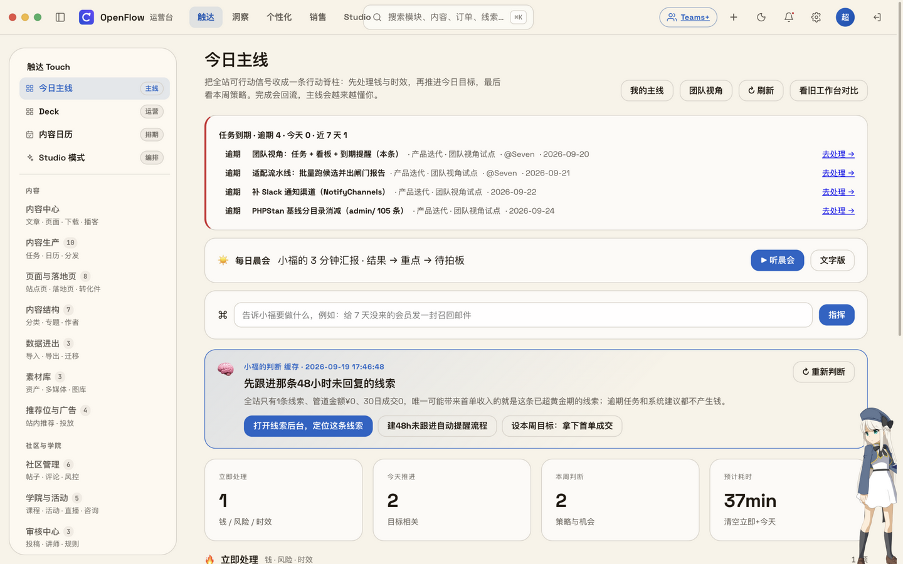
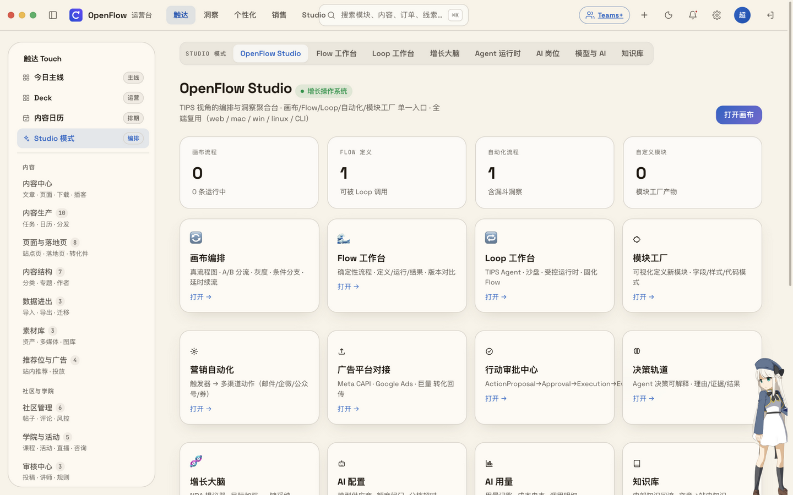
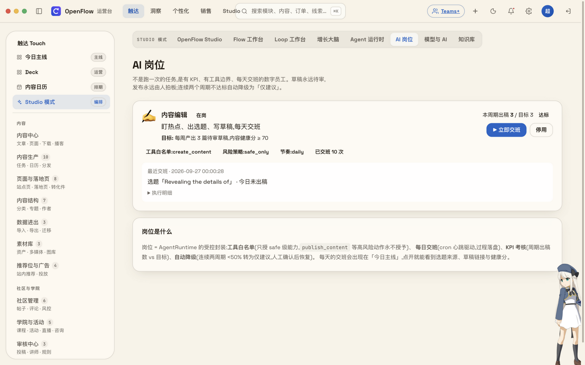
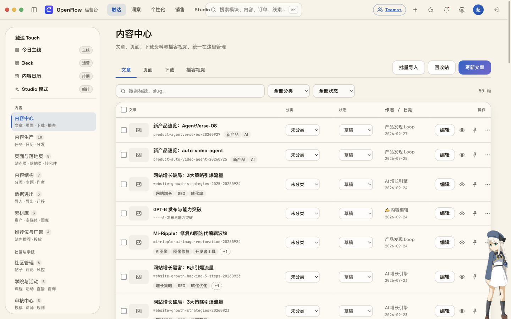
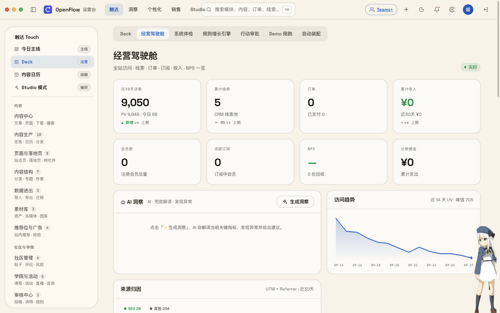
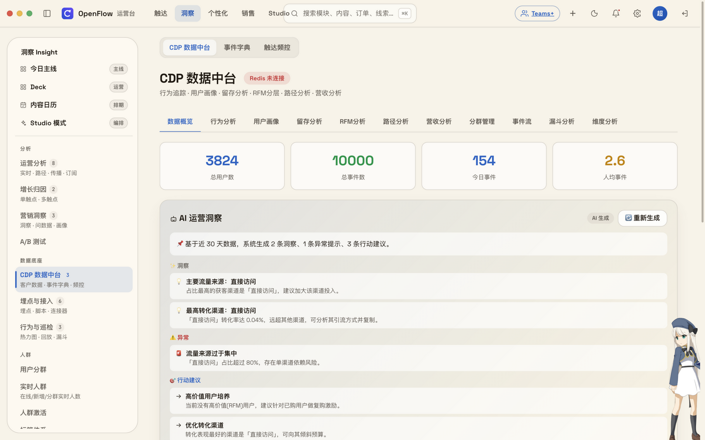
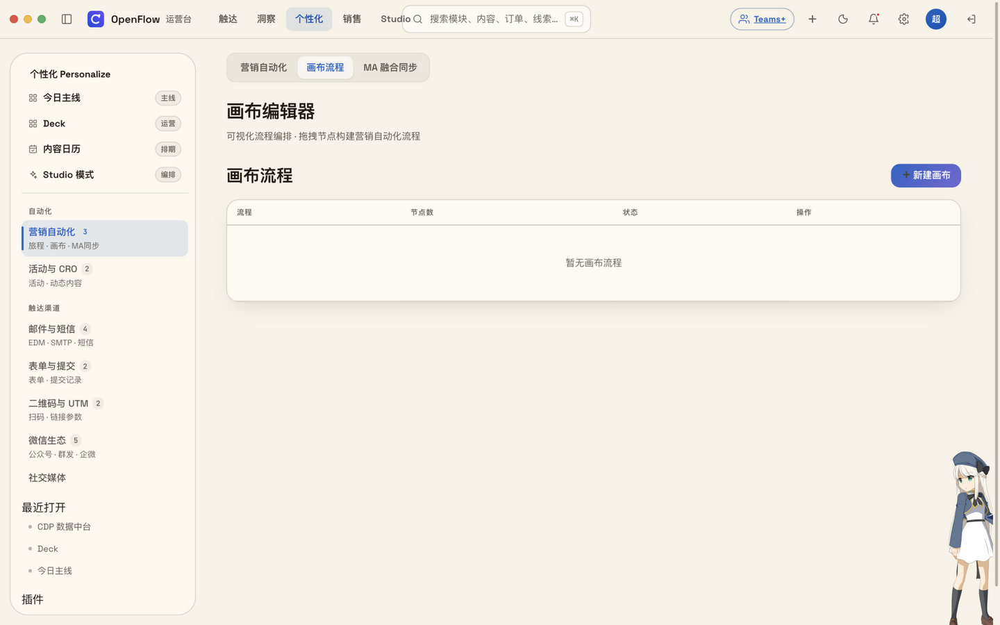

# 附录 · 功能总表(每个模块的截图 · 介绍 · 使用说明)

> 按 TIPS 四域 + 系统组织,与后台导航一一对应(共 189 项)。
> 每项含:功能介绍(1-2 句,讲用户价值不讲实现)/ 使用说明(怎么开始用)/ 截图。
> 标注 📷 的有真实截图;未标注的为「截图待补」,样式统一不缺位。

后台的信息架构与 TIPS 一一对应:**置顶入口**(今日主线 · Deck 与经营驾驶舱 · 内容日历 · Studio 模式)永远在侧栏最上面;之下是**触达 Touch / 洞察 Insight / 个性化 Personalize / 销售 Sales** 四个区,相邻功能收成一簇,点进去顶部子标签条在兄弟页之间直接跳转;**系统区的入口在顶栏齿轮悬停面板**,不占侧栏。四力不是四个功能区,而是一条反馈回路——触达建立有效接触,洞察形成证据与判断,个性化逐人匹配策略,销售推动成交并让真相回流;每章开头一句话,讲这个域在回路里的位置。

---

## 触达 Touch

Touch 是 DRI 对外发出信号的每一个触点——内容、页面、分发、SEO/GEO、社区、学院,信号越准,回路的起点越稳。这一区共 67 项,外加三个置顶入口。

#### 今日主线 `后台 → 置顶 · /xmp/today`

全站可行动信号不按功能模块分散,而是收口成一条行动脊柱:立即 / 今日 / 本周三条泳道,直接回答「今天先做这件事」;完成与搁置都会回流,让明天的排序更懂你。

**怎么用**:登录后台,侧栏第一项就是「今日主线」;从最上面的卡片开始处理,办完的点完成,不急的挪去「本周」。

📷 

#### Studio 模式(编排台) `后台 → 置顶 · /xmp/studio`

增长操作系统的统一编排台:画布流程、Flow 工作台、Loop 工作台、增长大脑、Agent 运行时、AI 岗位、模型与 AI、知识库收进一个入口。Flow 是手动挡,Loop 是自动挡——挡位在这里换,方向盘永远在你手里。

**怎么用**:后台 → 侧栏置顶「Studio 模式」→ OpenFlow Studio;顶部子标签在八个工作台之间切换,建议先从 Flow 工作台把自己的 SOP 搭起来。

📷 

#### AI 岗位(常驻数字员工) `后台 → 置顶 · /xmp/agent-posts`

有目标、有工具边界、有交班、有考核的常驻数字员工——接住「你本来要雇人做」的那部分;每天的产出是草稿与建议,发布、群发的决定权全程在你手里。

**怎么用**:后台 → 置顶「Studio 模式」→ AI 岗位;新建岗位,写清目标与允许使用的工具,之后每天看交班记录并审批产出。

📷 

#### 内容中心 `后台 → 触达 · /xmp/content-hub`

文章、页面、下载、播客四类内容的统一入口,聚合视图减少页面跳转。

**怎么用**:登录后台 → 触达 → 内容中心;新建文章在「文章」页点新建,支持创作台 AI 生成草稿,富文本与 Markdown 双编辑模式。

📷 

#### 内容生产(任务 · 日历 · 分发) `后台 → 触达 · /xmp/create`

从选题到分发的整条内容产线,十个兄弟页收在一簇:创作台、生产任务、产品发现、热点雷达、内容日历、帮助中心、内容分发、分发渠道、版本对比、外部协作。**怎么用**:触达 → 内容生产;顶部子标签条在兄弟页之间跳转,默认落在创作台。

#### 创作台 `后台 → 触达 · /xmp/create`

统一内容创作入口,三条创作流:深度专栏(大纲→成文→草稿)、口播脚本(结构化节拍)、幻灯片(生成后进 /deck 放映)。**怎么用**:触达 → 内容生产 → 创作台;选一条流从大纲或节拍开始,AI 起草、你审改定稿。

#### 生产任务 `后台 → 触达 · /xmp/tasks`

任务分配:管理员给其他角色分派内容生产任务,谁在写什么、进度到哪,一眼看清。**怎么用**:触达 → 内容生产 → 生产任务;新建任务选负责人与截止时间,分配后对方在工作台看到待办。

#### 产品发现 `后台 → 触达 · /xmp/product-scout`

产品发现 Loop:每天自动发现新产品,AI 撰写介绍,产出入草稿池待审——一条可持续的内容供给线。**怎么用**:触达 → 内容生产 → 产品发现;开启后每天查看新草稿,审改通过即可进入发布流程。

#### 热点雷达 `后台 → 触达 · /xmp/trend-radar`

多源抓取热点,AI 聚类出热度榜并一键转成选题,直接接进内容链路——追热点不用再人工刷屏。**怎么用**:触达 → 内容生产 → 热点雷达;看聚类结果,选中意的热点点「转选题」。

#### 内容日历 `后台 → 触达 · /xmp/content-calendar`

排期视图:拖拽调整发布日期、定时发布、活动时间段,一个月的内容节奏在一张日历上。**怎么用**:触达 → 内容生产 → 内容日历(侧栏置顶也有直达入口);拖动卡片改期,点日期新建定时发布。

#### 帮助中心 `后台 → 触达 · /xmp/help-center`

帮助中心管理:分类与指南文章的增删改,保存后前台 /help 即时生效。**怎么用**:触达 → 内容生产 → 帮助中心;先建分类再写指南文章,发布即上线。

#### 内容分发 `后台 → 触达 · /xmp/publish`

一键发布文章到多平台:平台内容变体、定时分发、分发记录全在一个页面。有开放 API 的平台填好凭据即真发;通用 Webhook 可对接 n8n/Make/自建发布器;无 API 的平台生成原生文案后手动发布。**怎么用**:触达 → 内容生产 → 内容分发;选一篇已发布文章,勾目标平台,生成变体后分发。

#### 分发渠道 `后台 → 触达 · /xmp/channels`

分发渠道的凭据与推送接口配置,是内容分发真正「发得出去」的前提。**怎么用**:触达 → 内容生产 → 分发渠道;按渠道说明填凭据或 Webhook 地址,保存后在内容分发里即可勾选。

#### 版本对比 `后台 → 触达 · /xmp/version-diff`

任选两篇文章版本做差异对比与统计,改了什么、哪版更好,一目了然。**怎么用**:触达 → 内容生产 → 版本对比;选 A、B 两个版本,直接看逐行差异。

#### 外部协作 `后台 → 触达 · /xmp/collaborators`

发一条限时链接,把某一篇内容交给外面的人审阅:随时能看谁看过、留了什么意见,随时一键收回。链接明文只在发出的那一刻显示一次,之后系统里只剩哈希——找得回来的东西,泄漏一次就等于一直泄漏。**怎么用**:触达 → 内容生产 → 外部协作;选文章生成协作链接,复制发给对方,到期或用完即收回。

#### 页面与落地页(站点页 · 落地页 · 转化件) `后台 → 触达 · /xmp/pages?page=index`

站点页面与转化件的整条产线:页面编辑、Cluster 管理、落地页、模块工厂、落地页模块、组合模板、转化组件、转化目标八个兄弟页一簇管理。**怎么用**:触达 → 页面与落地页;顶部子标签条切换,默认落在页面编辑。

#### 页面编辑 `后台 → 触达 · /xmp/pages?page=index`

站点页面(首页、关于页等)的编辑器:字段按页面模块分组、折叠展开快速定位;支持自定义 Schema 嵌入页面 head,保存时自动 IndexNow 推送。**怎么用**:触达 → 页面与落地页 → 页面编辑;选目标页面,展开模块改字段,保存即生效。

#### Cluster 管理 `后台 → 触达 · /xmp/cluster`

聚合页的强化管理:手动聚合(挑文章进聚合)、规则聚合(标签/分类/作者/关键词/时间范围组合)、自动聚合(按规则自动归集)三种方式。**怎么用**:触达 → 页面与落地页 → Cluster 管理;新建聚合页选一种聚合方式,规则变更即重新匹配。

#### 落地页 `后台 → 触达 · /xmp/landing-pages`

落地页(聚合页)的创建与管理:新建、编辑、删除,是投放承接页的主入口。**怎么用**:触达 → 页面与落地页 → 落地页;新建落地页,套模块与组合模板快速成型。

#### 模块工厂 `后台 → 触达 · /xmp/modules`

可视化定义新模块:像 Elementor/Gutenberg 那样,后台声明模块的字段(schema)与样式,就能像内置块一样拖进落地页、到处复用——无需程序员写 PHP。**怎么用**:触达 → 页面与落地页 → 模块工厂;新建模块,声明字段类型(文本/图片/列表等)与样式,保存后即可在落地页使用。

#### 落地页模块 `后台 → 触达 · /xmp/page-modules`

可复用模块库:前端页面由各种模块/区块组成,这里集中管理模块的新建、复用、编辑、启用/停用。**怎么用**:触达 → 页面与落地页 → 落地页模块;把常用区块建成模块,搭页时直接调用。

#### 组合模板 `后台 → 触达 · /xmp/block-templates`

成套区块一次插入:内置业务模板,也支持另存为、导出导入与应用——页面骨架不用每次重搭。**怎么用**:触达 → 页面与落地页 → 组合模板;挑一套模板应用到落地页,或把自己的页面存成模板。

#### 转化组件 `后台 → 触达 · /xmp/conversion`

在线转化组件:全局顶部通知条等站内转化件,随页面配置随页生效。**怎么用**:触达 → 页面与落地页 → 转化组件;开启组件、写文案、定投放范围。

#### 转化目标 `后台 → 触达 · /xmp/conversion-goals`

命名转化目标:事件 + 作用域 + 价值,让落地页、A/B 测试与报表用同一套口径说话。**怎么用**:触达 → 页面与落地页 → 转化目标;先在这里定义「注册」「下单」等目标,后续报表与实验直接引用。

#### 内容结构(分类 · 专题 · 作者) `后台 → 触达 · /xmp/categories?type=article`

内容骨架管理:分类、专题、作者、自定义内容类型、多维表格视图、内容多语言、学院首页配置七个兄弟页一簇。**怎么用**:触达 → 内容结构;顶部子标签条切换,默认落在分类。

#### 分类 `后台 → 触达 · /xmp/categories?type=article`

分类管理:文章等多类型内容的目录树,决定站点信息架构。**怎么用**:触达 → 内容结构 → 分类;按类型新建/编辑分类,内容发布时挂到对应分类。

#### 专题 `后台 → 触达 · /xmp/topics`

专题管理:把一组相关内容收进一个专题页,做深读路径。**怎么用**:触达 → 内容结构 → 专题;新建专题、挑入内容,专题页自动成形。

#### 作者 `后台 → 触达 · /xmp/authors`

把散落的作者名字收成一等身份:给作者建带简介/头像/链接/绑定账号的档案;「已署名但没建档」的一键登记;「同一个人两种写法」合并成一个。**怎么用**:触达 → 内容结构 → 作者;先看「待登记」清单一键建档,再维护作者详情。

#### 自定义内容类型 `后台 → 触达 · /xmp/cpt`

定义自己的内容类型(字段集)并管理各类型的条目——文章之外,测评、案例、工具收录都能成为一等公民。**怎么用**:触达 → 内容结构 → 自定义内容类型;先定义类型与字段,再在该类型下录条目。

#### 多维表格视图 `后台 → 触达 · /xmp/table-views`

同一批记录四种看法:表格看全貌、看板看进度、日历看排期、甘特看跨度。**怎么用**:触达 → 内容结构 → 多维表格视图;右上角切换 grid / board / calendar / gantt。

#### 内容多语言 `后台 → 触达 · /xmp/content-i18n`

给文章挂语言版本:AI 一键初译、人工复核后发布,一个内容 multiple 语言市场。**怎么用**:触达 → 内容结构 → 内容多语言;选文章挂目标语言,AI 初译后复核发布。

#### 学院首页配置 `后台 → 触达 · /xmp/community-config`

Academy 内容首页配置:头条推荐等版位人工编排,学院首页呈现你想要的顺序。**怎么用**:触达 → 内容结构 → 学院首页配置;置顶头条、调整版位,保存后前台生效。

#### 数据进出(导入 · 导出 · 迁移) `后台 → 触达 · /xmp/ingest`

数据进出三件套:外部导入、数据导出、数据迁移——你的内容资产随时进得来、出得去。**怎么用**:触达 → 数据进出;顶部子标签条切换三个方向。

#### 外部导入 `后台 → 触达 · /xmp/ingest`

内容导入连接器:飞书 / Notion / Obsidian / 印象笔记的文章一键转成本站草稿。**怎么用**:触达 → 数据进出 → 外部导入;授权或粘贴,选目标文章,导入后进草稿池。

#### 数据导出 `后台 → 触达 · /xmp/data-export`

数据导入/导出:文章、用户、订单等数据打包带走——数据是你的,随时可迁走。**怎么用**:触达 → 数据进出 → 数据导出;选数据范围导出文件。

#### 数据迁移 `后台 → 触达 · /xmp/migrate`

历史数据迁移助手:老系统 → OpenFlow,导入文章/线索/用户/评论,字段映射适配,预览 + 冲突处理 + 报告。**怎么用**:触达 → 数据进出 → 数据迁移;上传旧数据文件,按向导做字段映射,先预览再执行。

#### 素材库(资产 · 多媒体 · 图库) `后台 → 触达 · /xmp/dam`

品牌资产与媒体素材的家:数字资产、多媒体、免费图库三个兄弟页一簇。**怎么用**:触达 → 素材库;顶部子标签条切换,默认落在数字资产。

#### 数字资产 `后台 → 触达 · /xmp/dam`

品牌数字资产管理(DAM),独立于通用媒体库:Logo / 字体 / 色彩 / 图标 / 插画 / 模板 / 视频 / 音频按类型细分归档。**怎么用**:触达 → 素材库 → 数字资产;按类型上传归档,品牌件从此有唯一权威版本。

#### 多媒体 `后台 → 触达 · /xmp/media`

媒体管理:图片、视频、附件的上传、检索与引用管理,日常内容生产的弹药库。**怎么用**:触达 → 素材库 → 多媒体;上传或拖入文件,写文章时直接从媒体库选取。

#### 免费图库 `后台 → 触达 · /xmp/stock-photos`

免费图库聚合:Pexels / Unsplash / Pixabay 站内搜索浏览,一键下载到本地媒体库。**怎么用**:触达 → 素材库 → 免费图库;配置任一平台的 API Key 后搜图,点下载入库存用。

#### 推荐位与广告(站内推荐 · 投放) `后台 → 触达 · /xmp/featured`

站内流量位集中管理:推荐位、站内投放、广告位、投放管理四个兄弟页一簇。**怎么用**:触达 → 推荐位与广告;顶部子标签条切换,默认落在推荐位。

#### 推荐位 `后台 → 触达 · /xmp/featured`

站内推荐位管理:首页等位置的推荐内容编排,把好内容放到流量最大的地方。**怎么用**:触达 → 推荐位与广告 → 推荐位;选推荐位,添加/排序推荐条目。

#### 站内投放 `后台 → 触达 · /xmp/promos`

站内营销投放统一后台:通知条 / 弹窗 / 内嵌模块收进一个入口,每条都能定 页面 × 位置 × 人群 × 定时 × 频次,并看展示/点击/关闭数据。**怎么用**:触达 → 推荐位与广告 → 站内投放;新建投放,选类型与页面位置、圈人群、定时。

#### 广告位 `后台 → 触达 · /xmp/ads`

广告位管理:文章顶部/底部、社区 Banner、瀑布流信息流广告位;优先使用 HTML 代码,其次图片+链接。**怎么用**:触达 → 推荐位与广告 → 广告位;选广告位,填 HTML 或图片素材上架。

#### 投放管理 `后台 → 触达 · /xmp/ad-campaigns`

投放管理:计划 / 素材 / 指标 / ROI 一页看清,外部投放也有账可算。**怎么用**:触达 → 推荐位与广告 → 投放管理;新建投放计划,录入素材与花费,回收指标看 ROI。

#### 社区管理(帖子 · 评论 · 风控) `后台 → 触达 · /xmp/community-mod`

社区运营中枢:社区管理、评论/点评、风控中心、举报、收藏、关注六个兄弟页一簇。**怎么用**:触达 → 社区管理;顶部子标签条切换,默认落在社区管理。

#### 社区管理(帖子 · 评论 · 话题) `后台 → 触达 · /xmp/community-mod`

社区帖子、评论、话题的日常管理:内容流转、置顶删改都在这里。**怎么用**:触达 → 社区管理;按列表处理帖子与话题,违规内容直接处置。

#### 评论 / 点评 `后台 → 触达 · /xmp/comments`

文章评论 + 导航站点评的统一审核台:审核、置顶、隐藏、删除一手操作。**怎么用**:触达 → 社区管理 → 评论 / 点评;按待审队列逐条处理。

#### 风控中心 `后台 → 触达 · /xmp/moderation`

风控与审核中枢:审核队列 + 规则配置 + 一键扫描 + AI 辅助审核——精细审核、定期扫描、AI 初判、人工复核。**怎么用**:触达 → 社区管理 → 风控中心;先在「规则」页配违禁策略,日常在「审核队列」处理,「扫描」页可全站体检。

#### 举报 `后台 → 触达 · /xmp/reports`

用户举报系统:前台用户可对内容举报,举报汇入后台审核处理,判定与处置和风控中心同一套流程。**怎么用**:触达 → 社区管理 → 举报(/xmp/reports);日常处置结合风控中心的审核队列与扫描结果。

#### 收藏 `后台 → 触达 · /xmp/bookmarks`

收藏管理:用户收藏了什么,是内容价值的另一面镜子。**怎么用**:触达 → 社区管理 → 收藏;浏览收藏清单,辅助判断哪类内容值得加码。

#### 关注 `后台 → 触达 · /xmp/follows`

关注管理:用户之间的关注关系一览,社区活跃度与关键节点人物的抓手。**怎么用**:触达 → 社区管理 → 关注;查看关注关系分布,识别社区里的连接者。

#### 学院与活动(课程 · 活动 · 直播 · 咨询) `后台 → 触达 · /xmp/courses`

知识变现与活动运营一簇:课程、活动、直播、1v1 咨询、增长导航五个兄弟页。**怎么用**:触达 → 学院与活动;顶部子标签条切换,默认落在课程。

#### 课程 `后台 → 触达 · /xmp/courses`

课程管理:课程的创建、章节与定价维护,知识产品的生产线。**怎么用**:触达 → 学院与活动 → 课程;新建课程、编章节、定价格,发布后前台可购。

#### 活动 `后台 → 触达 · /xmp/events`

活动管理:活动创建与报名名单全流程——审核、签到、出勤率、名额一目了然。**怎么用**:触达 → 学院与活动 → 活动;新建活动开报名,活动后在报名名单页看签到与出勤。

#### 直播 `后台 → 触达 · /xmp/live`

直播管理:创建直播房间、OBS 推流密钥、挂售卖课程、回放管理。**怎么用**:触达 → 学院与活动 → 直播;新建房间,把推流密钥填进 OBS,开播后自动生成回放。

#### 1v1 咨询 `后台 → 触达 · /xmp/consultation`

1v1 咨询管理:咨询师库 + 预约单全流程(审核 / 确认时间 / 交付回放),把个人时间变成产品。**怎么用**:触达 → 学院与活动 → 1v1 咨询;先建咨询师档案,再处理预约单:确认时间、交付后传回放。

#### 增长导航 `后台 → 触达 · /xmp/navigation`

导航站管理:国内外优秀增长/SEO/AI 运营工具与资源网站的收录与维护。**怎么用**:触达 → 学院与活动 → 增长导航;收录好工具、补描述与标签,访客按图索骥。

#### 审核中心(投稿 · 讲师 · 规则) `后台 → 触达 · /xmp/approvals`

UGC 质量闸门:内容与资质审核、内容审核、审核规则三个兄弟页一簇。**怎么用**:触达 → 审核中心;顶部子标签条切换,默认落在内容与资质审核。

#### 内容与资质审核 `后台 → 触达 · /xmp/approvals`

审核中心:讲师申请 + 文章投稿两类资质与内容的审批入口。**怎么用**:触达 → 审核中心;按申请类型逐条批准或驳回,驳回写明原因。

#### 内容审核 `后台 → 触达 · /xmp/reviews`

内容审核待办:待审核列表 + 审核操作(仅管理员与市场总监可审)。**怎么用**:触达 → 审核中心 → 内容审核;对待审内容通过/退回。

#### 审核规则 `后台 → 触达 · /xmp/review-settings`

审核规则配置:违禁词 / 竞品词 / 低质词 / 产品定位关键词,让机器先把住第一道关。**怎么用**:触达 → 审核中心 → 审核规则;维护四类词库,保存后自动参与审核判定。

#### SEO 中心 `后台 → 触达 · /xmp/seo-center`

把原先分散的 7 个 SEO 页面收进一个 tab 页:页面 SEO、工具、重定向等集中处理,旧 URL 自动 301 到对应 tab。**怎么用**:触达 → SEO 中心;按顶部标签逐页检查:元信息、站点地图、重定向、结构化数据。

#### 舆情与 GEO(口碑 · 话题监控) `后台 → 触达 · /xmp/sentiment`

AI 时代的搜索声誉管理:舆情监测与 GEO 话题监控两个兄弟页——传统搜索口碑与 AI 引用一张网看住。**怎么用**:触达 → 舆情与 GEO;顶部子标签条切换两个视角。

#### 舆情监测 `后台 → 触达 · /xmp/sentiment`

舆情监测中心:多源搜索 + AI 洞察 + 舆情报告,品牌口碑的变化自动送上门。**怎么用**:触达 → 舆情与 GEO → 舆情监测;配置监测关键词,定期看 AI 洞察与报告。

#### GEO 话题监控 `后台 → 触达 · /xmp/geo`

GEO(生成式引擎优化)管理:话题监控、AI 生成、自动提交——让你的内容在 AI 回答里被引用。**怎么用**:触达 → 舆情与 GEO → GEO 话题监控;添加目标话题,AI 生成内容后自动提交。

#### 问卷与 NPS(问卷 · 统计 · NPS) `后台 → 触达 · /xmp/survey`

用户声音的采集端:问卷调研、问卷统计、NPS 三个兄弟页一簇。**怎么用**:触达 → 问卷与 NPS;顶部子标签条切换。

#### 问卷调研 `后台 → 触达 · /xmp/survey`

调研系统:问卷的创建、编辑与回收,一次投放拿到结构化用户反馈。**怎么用**:触达 → 问卷与 NPS → 问卷调研;新建问卷、编辑题目,发布后回收进统计。

#### 问卷统计 `后台 → 触达 · /xmp/survey-stats`

问卷统计查看(按角色限定范围):回收率、分布与交叉,数据说话。**怎么用**:触达 → 问卷与 NPS → 问卷统计;选问卷看各题统计与趋势。

#### NPS `后台 → 触达 · /xmp/nps`

NPS 调研系统:项目管理与统计,推荐值的变化是产品口碑的体温计。**怎么用**:触达 → 问卷与 NPS → NPS;建 NPS 项目、看分数与分层评论,贬损者原因重点读。

---

## 洞察 Insight

Insight 让每一次触达的结果回流成证据——看清谁来了、做了什么、为什么转化;没有真相回流,增长只是碰运气。这一区共 36 项,外加驾驶舱入口。

#### 增长驾驶舱 `后台 → 置顶 · /xmp/dashboard`

全站经营驾驶舱:KPI、漏斗与 AI 解读在一张大屏上——TIPS 回路里「洞察」的一半靠它,每天开盘先看真相再动决策。

**怎么用**:后台 → 侧栏置顶「Deck」→ 经营驾驶舱;先看异常指标与 AI 解读,再决定今天先动哪条线。

📷 

#### 运营分析(实时 · 路径 · 传播 · 订阅) `后台 → 洞察 · /xmp/analytics`

分析主簇:运营分析、自定义报表、标签管理、广告平台对接、实时数据、路径分析、分享传播、报表订阅八个兄弟页。**怎么用**:洞察 → 运营分析;顶部子标签条切换,默认落在运营分析。

#### 运营分析(漏斗 · RFM · 流失预警) `后台 → 洞察 · /xmp/analytics`

运营分析主页:转化漏斗、RFM 分层、流失预警——不只看总量,更看谁在流失、谁值得追。**怎么用**:洞察 → 运营分析 → 运营分析;先看漏斗,再按 RFM 分层处理流失预警名单。

#### 自定义报表 `后台 → 洞察 · /xmp/reports`

任意「维度 × 指标 × 筛选」自由构建报表,服务端聚合,每一行可下钻到原始记录,报表可保存复用。**怎么用**:洞察 → 运营分析 → 自定义报表;选数据源(行为事件/订单/线索)与指标维度,构建后保存。

#### 标签管理 `后台 → 洞察 · /xmp/tag-rules`

CDP 自动打标规则:每条规则 = 打什么标签 + 什么条件下触发,支持事件、行为摘要、生命周期、属性四类条件——标签从手打散字符串变成规则引擎驱动。**怎么用**:洞察 → 运营分析 → 标签管理;新建规则选条件类型,命中后 CDP 自动给访问者打标。

#### 广告平台对接 `后台 → 洞察 · /xmp/ma-platforms`

广告平台转化回传连接管理(CAPI):按平台配置 pixel/customer/advertiser id 与事件映射,把转化信号回传给广告平台——投放模型才有真数据可学。**怎么用**:洞察 → 运营分析 → 广告平台对接;按平台填凭据与事件名映射,保存后在平台后台验证回传。

#### 实时数据 `后台 → 洞察 · /xmp/realtime`

站点实时指标:此刻的访问与行为,活动上线、投放开闸后的第一反应屏。**怎么用**:洞察 → 运营分析 → 实时数据;挂在副屏,活动期间盯实时曲线。

#### 路径分析 `后台 → 洞察 · /xmp/path-analysis`

用户访问路径、入口出口、跳出率、热门流转——用户怎么走、在哪拐弯、从哪离开。**怎么用**:洞察 → 运营分析 → 路径分析;看热门流转找断点,回到对应页面优化。

#### 分享传播 `后台 → 洞察 · /xmp/share-kols`

分享传播分析:分享贡献者排行(按带来的访问 / 转化排序)——你的自然 KOL 就藏在这里。**怎么用**:洞察 → 运营分析 → 分享传播;看排行,主动连接带来最多流量的分享者。

#### 报表订阅 `后台 → 洞察 · /xmp/report-subscribe`

报表邮件订阅:每日/每周经营报表自动推送,不开后台也能掌握经营脉搏。**怎么用**:洞察 → 运营分析 → 报表订阅;选报表与频率,填收件邮箱即可。

#### 增长归因(单触点 · 多触点) `后台 → 洞察 · /xmp/attribution`

归因双页簇:增长归因看板 + 多触点归因——回答「这次成交是谁带来的」。**怎么用**:洞察 → 增长归因;顶部子标签条切换两个视角。

#### 增长归因(看板) `后台 → 洞察 · /xmp/attribution`

增长归因看板:合并 UTM / 分享传播 / 二维码三个来源,渠道贡献一屏对齐。**怎么用**:洞察 → 增长归因;按来源与渠道看转化贡献,预算向高贡献渠道倾斜。

#### 多触点归因 `后台 → 洞察 · /xmp/attribution-model`

多触点归因:不把功劳记给最后一次点击,而看完整触点链路的组合贡献。**怎么用**:洞察 → 增长归因 → 多触点归因;选归因模型看链路报告,理解辅助触点的价值。

#### 营销洞察(洞察 · 问数据 · 画像) `后台 → 洞察 · /xmp/insights`

营销洞察三页簇:营销洞察看板、问数据、用户画像——从汇总到对话到个体。**怎么用**:洞察 → 营销洞察;顶部子标签条切换。

#### 营销洞察(看板) `后台 → 洞察 · /xmp/insights`

营销洞察看板:表单 / 调研 / NPS 数据汇总与趋势,市场侧的反馈一眼读全。**怎么用**:洞察 → 营销洞察;按数据源切换看趋势,异常波动点进去查明细。

#### 问数据 `后台 → 洞察 · /xmp/ask-data`

对话式 BI:一句话问全站经营数据,AI 选数据集 + 回答 + 出图 + 追问——数字全部来自真实数据,不含糊。**怎么用**:洞察 → 营销洞察 → 问数据;直接输入问题,如「上个月哪个渠道线索最多」,继续追问可收窄。

#### 用户画像 `后台 → 洞察 · /xmp/profiling`

三个维度看人:整体画像(全量客户 · 筛选 · 分群分层)、个人画像(单用户标签/积分/等级/行为卡)、详细资料(来源渠道 · 首末次访问 · 完整行为时间线)。**怎么用**:洞察 → 营销洞察 → 用户画像;先看整体分层,再点进个人画像逐人研读。

#### A/B 测试 `后台 → 洞察 · /xmp/abtests`

A/B 测试管理:分流显示与效果统计,用实验而不是吵架决定用哪个版本。**怎么用**:洞察 → A/B 测试;新建实验、定分流比例与目标,跑够样本后看结果定版。

#### CDP 数据中台(客户数据 · 事件字典 · 频控) `后台 → 洞察 · /xmp/cdp`

数据底座主簇:CDP 数据中台、事件字典、触达频控三个兄弟页——所有个性化与自动化的地基。**怎么用**:洞察 → CDP 数据中台;顶部子标签条切换。

#### CDP 数据中台 `后台 → 洞察 · /xmp/cdp`

客户数据中台:每个访客的来源、行为、标签与成交一人一册,AI 运营洞察直接给出「下一步动谁、怎么动」的依据。

**怎么用**:洞察 → CDP 数据中台;先看 AI 洞察与人群概览,再按人下钻完整时间线。

📷 

#### 事件字典 `后台 → 洞察 · /xmp/event-dictionary`

事件字典与 Tracking Plan:每个事件的定义、口径与数据质量——埋点不失忆,数据才可信。**怎么用**:洞察 → CDP 数据中台 → 事件字典;按字典核对事件口径,质量问题按清单修。

#### 触达频控 `后台 → 洞察 · /xmp/frequency-cap`

触达频控 / 疲劳度:跨渠道触达上限配置——个性化不等于轰炸,把用户当人先从别吵开始。**怎么用**:洞察 → CDP 数据中台 → 触达频控;按渠道与人群设触达上限,自动化自动遵守。

#### 埋点与接入(埋点 · 脚本 · 连接器) `后台 → 洞察 · /xmp/tracking`

数据接入六页簇:埋点、圈选埋点、脚本、数据连接器、入站接收、外部连接。**怎么用**:洞察 → 埋点与接入;顶部子标签条切换。

#### 埋点 `后台 → 洞察 · /xmp/tracking`

行为追踪:Webhook 回传配置 + 事件查看,外部行为也能汇进同一套 CDP。**怎么用**:洞察 → 埋点与接入 → 埋点;配置回传地址,在事件列表核对数据是否到位。

#### 圈选埋点 `后台 → 洞察 · /xmp/click-tracking`

圈选埋点:点一下页面元素就完成埋点——不必等开发排期,运营自己就能采集。**怎么用**:洞察 → 埋点与接入 → 圈选埋点;输入页面地址,圈选目标元素,保存即生效。

#### 脚本 `后台 → 洞察 · /xmp/scripts`

脚本与埋点管理:全局 head/body 脚本注入,统计代码、验证文件、第三方组件的统一入口。**怎么用**:洞察 → 埋点与接入 → 脚本;粘贴第三方脚本到 head 或 body 区,保存全站生效。

#### 数据连接器 `后台 → 洞察 · /xmp/data-connector`

数据连接器:配置外部数据源并执行同步,同步结果当场可见。**怎么用**:洞察 → 埋点与接入 → 数据连接器;新建连接器、填源配置,点同步看结果。

#### 入站接收 `后台 → 洞察 · /xmp/inbound`

入站数据连接器:外部系统向本站推送数据(CRM 线索 / CDP 事件 / 画像),接口开放、数据进得来。**怎么用**:洞察 → 埋点与接入 → 入站接收;按页面给出的接口约定,让外部系统 POST 数据进来。

#### 外部连接 `后台 → 洞察 · /xmp/data-sync`

外部数据连接器:REST API / CSV 主动拉取外部数据到 CDP / CRM——存量名单、历史订单都能请进来。**怎么用**:洞察 → 埋点与接入 → 外部连接;配置 API 或 CSV 源,定拉取字段与目标库,执行同步。

#### 行为与巡检(热力图 · 回放 · 漏斗) `后台 → 洞察 · /xmp/heatmap`

行为体检三页簇:点击热力图、会话回放、漏斗巡检——数据之外,亲眼看用户怎么用。**怎么用**:洞察 → 行为与巡检;顶部子标签条切换。

#### 点击热力图 `后台 → 洞察 · /xmp/heatmap`

页面元素级点击热区:前端事件带坐标,按页面聚合后 iframe 叠加渲染——哪块被点烂、哪块没人看,一图定论。**怎么用**:洞察 → 行为与巡检 → 点击热力图;选页面看热区,把关键 CTA 挪向热区。

#### 会话回放 `后台 → 洞察 · /xmp/session-replay`

会话录屏回放(轻量):按会话重放用户的点击/滚动/事件轨迹,像坐在用户旁边看他怎么用。**怎么用**:洞察 → 行为与巡检 → 会话回放;按 session 选一段,canvas 动画重放全程。

#### 漏斗巡检 `后台 → 洞察 · /xmp/funnel-guard`

转化漏斗巡检:落地页/渠道转化率环比自动告警——转化率悄悄掉了,系统先于你发现。**怎么用**:洞察 → 行为与巡检 → 漏斗巡检;定义关键漏斗与阈值,异常自动出现在告警列表。

#### 用户分群 `后台 → 洞察 · /xmp/segments`

按行为与属性把用户分成可触达的群,供自动化、触达与 CRM 使用——一切个性化动作的人口学起点。**怎么用**:洞察 → 用户分群;新建分群,选行为/属性条件,保存后各处可直接引用。

#### 实时人群(在线/新增/分群实时人数) `后台 → 洞察 · /xmp/audience-live`

实时人群看板:在线、今日新增、近 7 日活跃 + 各分群实时人数,自动刷新。**怎么用**:洞察 → 实时人群;挂在大屏,分群人数异动第一时间看到。

#### 人群激活 `后台 → 洞察 · /xmp/destinations`

人群激活(Destinations):把 CDP 人群推到外部——洞察不止于看,还要送出去用。**怎么用**:洞察 → 人群激活;选目标分群,配置激活目的地,推送即可。

#### 标签体系 `后台 → 洞察 · /xmp/tag-rules`

从人群视角看标签:规则引擎自动打标 + 人工标签构成用户认知体系,是分群与激活的原料。**怎么用**:洞察 → 标签体系;盘点现有标签,补规则让高频标签自动化。

---

## 个性化 Personalize

Personalize 把洞察变成对的动作:对不同的人、在对的时机、做对的事。Flow 的手动挡从这里开始——规则来自你,执行交给系统,每一步留痕可复盘。这一区共 25 项。

#### 营销自动化(旅程 · 画布 · MA同步) `后台 → 个性化 · /xmp/automation`

自动化主簇:营销自动化、画布流程、MA 融合同步三个兄弟页——从规则旅程到可视化画布到外部 MA 打通。**怎么用**:个性化 → 营销自动化;顶部子标签条切换,默认落在营销自动化。

#### 营销自动化(旅程) `后台 → 个性化 · /xmp/automation`

营销自动化:流程编排(触发 → 动作),欢迎序列、召回提醒、培育旅程按规则自动跑。**怎么用**:个性化 → 营销自动化;新建流程,选触发器(如订阅、注册),接上动作与延时,启用。

#### 画布流程 `后台 → 个性化 · /xmp/canvas`

可视化流程编排:把触发器、条件、动作与延时拖成一张图,你的 SOP 变成系统确定性执行的 Flow——方法来自你,执行交给系统,留痕给你复盘。

**怎么用**:个性化 → 营销自动化 → 画布流程;新建画布,从触发器开始拖节点,发布前先试运行检查。

📷 

#### MA 融合同步 `后台 → 个性化 · /xmp/ma-sync`

MA 融合同步配置:Mautic + BillionMail,OpenFlow 的人群与外部营销系统双向对齐。**怎么用**:个性化 → 营销自动化 → MA 融合同步;填外部系统凭据,选同步对象与方向。

#### 活动与 CRO(活动 · 动态内容) `后台 → 个性化 · /xmp/campaigns`

转化率优化双页簇:活动 / CRO + Dynamic Engine——成组的转化件与逐人变化的内容。**怎么用**:个性化 → 活动与 CRO;顶部子标签条切换。

#### 活动 / CRO `后台 → 个性化 · /xmp/campaigns`

Campaign 管理:一个活动 = 一组带排期、页面范围的转化组件(通知条 / 底部 CTA / 弹窗 / 文中 CTA),上线节奏整批控。**怎么用**:个性化 → 活动与 CRO → 活动 / CRO;新建活动,圈页面范围、挂转化组件、定排期。

#### Dynamic Engine `后台 → 个性化 · /xmp/dynamic-content`

Dynamic Content 管理:基于 URL 参数的动态内容规则——同一个页面,投广告人群看到的文案可以完全不同。**怎么用**:个性化 → 活动与 CRO → Dynamic Engine;新建规则,匹配 URL 参数,替换对应内容块。

#### 邮件与短信(EDM · SMTP · 短信) `后台 → 个性化 · /xmp/email`

直触渠道簇:邮件、Newsletter 编辑器、送达率中心、短信四个兄弟页。**怎么用**:个性化 → 邮件与短信;顶部子标签条切换,默认落在邮件。

#### 邮件 `后台 → 个性化 · /xmp/email`

邮件营销:BillionMail 配置与群发管理,EDM 的主阵地。**怎么用**:个性化 → 邮件与短信 → 邮件;先在配置页接好 SMTP/BillionMail,再建列表群发。

#### Newsletter 编辑器 `后台 → 个性化 · /xmp/newsletter-editor`

Revue 式 Newsletter:选一篇文章自动排版成美观 newsletter(标题/封面/摘要/CTA),可视化编辑、实时预览、定时发送一气呵成。**怎么用**:个性化 → 邮件与短信 → Newsletter 编辑器;选文章生成初稿,编辑预览后发给订阅者或先发测试。

#### 送达率中心 `后台 → 个性化 · /xmp/email-deliverability`

邮件送达率中心:发件域认证自检(SPF/DKIM/DMARC)、抑制名单、退信投诉率、邮件收入归因——发得出去才算触达。**怎么用**:个性化 → 邮件与短信 → 送达率中心;先跑认证自检,按提示补 DNS 记录,盯退信投诉率。

#### 短信 `后台 → 个性化 · /xmp/sms`

短信管理:短信供应商配置与发送管理,验证码与关键触达的兜底通道。**怎么用**:个性化 → 邮件与短信 → 短信;选供应商填凭据,测试通过后再批量发送。

#### 表单与提交(表单 · 提交记录) `后台 → 个性化 · /xmp/forms`

线索入口簇:表单 + 提交记录——所有「留资」的进与出。**怎么用**:个性化 → 表单与提交;顶部子标签条切换。

#### 表单 `后台 → 个性化 · /xmp/forms`

表单管理:创建与编辑表单,嵌到落地页与文章里开始收集线索。**怎么用**:个性化 → 表单与提交 → 表单;新建表单、拖字段,复制嵌入代码到页面。

#### 提交记录 `后台 → 个性化 · /xmp/submissions`

提交记录:每一条表单提交的明细,下游跟进与清洗的原始账本。**怎么用**:个性化 → 表单与提交 → 提交记录;按表单筛选查看,导出或转给 CRM 跟进。

#### 二维码与 UTM(扫码 · 链接参数) `后台 → 个性化 · /xmp/qr`

线下与渠道追踪簇:二维码 + UTM 生成器——每个渠道来的流量都可辨识。**怎么用**:个性化 → 二维码与 UTM;顶部子标签条切换。

#### 二维码 `后台 → 个性化 · /xmp/qr`

二维码管理:批量生成带参数的二维码,配套扫码统计——传单、海报、包装上的码各有各的账。**怎么用**:个性化 → 二维码与 UTM → 二维码;新建二维码绑定链接,下载投放,扫码数据回来看统计。

#### UTM 生成器 `后台 → 个性化 · /xmp/utm-builder`

UTM 链接生成器:按规范拼 utm 参数,渠道归因从链接这一步就做对。**怎么用**:个性化 → 二维码与 UTM → UTM 生成器;填来源/媒介/活动名,生成链接复制使用。

#### 微信生态(公众号 · 群发 · 企微) `后台 → 个性化 · /xmp/wechat-mp`

微信五页簇:公众号、群发 & 私信、服务号标签、客服 / 模板消息、企业微信。**怎么用**:个性化 → 微信生态;顶部子标签条切换,默认落在公众号。

#### 公众号 `后台 → 个性化 · /xmp/wechat-mp`

WeChat 公众号 & 小程序配置管理:凭据、菜单与回调,微信触达的总开关。**怎么用**:个性化 → 微信生态 → 公众号;填 AppID/AppSecret 完成接入,测试通过再开功能。

#### 群发 & 私信 `后台 → 个性化 · /xmp/wechat-send`

微信群发:面向粉丝的群发与私信管理,按标签圈人精准触达。**怎么用**:个性化 → 微信生态 → 群发 & 私信;新建群发,选目标标签与素材,提交发送。

#### 服务号标签 `后台 → 个性化 · /xmp/wechat-tags`

微信标签管理:给粉丝打标签、维护标签组,微信侧分群的底座。**怎么用**:个性化 → 微信生态 → 服务号标签;同步粉丝,按行为或手动打标。

#### 客服 / 模板消息 `后台 → 个性化 · /xmp/wechat-messages`

客服消息 & 模板消息:回复用户咨询、发送服务通知,合规触达的两条正规通道。**怎么用**:个性化 → 微信生态 → 客服 / 模板消息;在会话列表回复客服消息,模板消息按场景配置发送。

#### 企业微信 `后台 → 个性化 · /xmp/wecom`

企业微信管理:企微应用的配置与同步,把客户运营延伸到私域工作台。**怎么用**:个性化 → 微信生态 → 企业微信;填企微凭据完成对接,按引导同步通讯录与客户。

#### 社交媒体 `后台 → 个性化 · /xmp/social`

社交媒体:账号管理 · Footer 显示 · 一键分享设置——站点内容在社交平台的门面与出口。**怎么用**:个性化 → 社交媒体;添加社交账号,勾选是否在 Footer 与分享按钮中显示。

---

## 销售 Sales

Sell 是回路的收口:把意向换成收入——CRM、订单、商城、会员、分销;成交与丢单的真相在这里回流洞察,飞轮从这里转起来。这一区共 29 项。

#### CRM 线索(线索 · 公海 · 企业客户) `后台 → 销售 · /xmp/crm`

客户主簇:CRM 线索 + 企业客户——从线索到成交的主战场。**怎么用**:销售 → CRM 线索;顶部子标签条切换,默认落在 CRM 线索。

#### CRM 线索(阶段 · 打分) `后台 → 销售 · /xmp/crm`

CRM 线索管理:阶段、打分、跟进、交接、商机转化——线索不再是表格里的一行,而是可推进的流水线。**怎么用**:销售 → CRM 线索;新建或导入线索,按阶段推进,高意向线索及时转商机。

#### 企业客户 `后台 → 销售 · /xmp/orgs`

企业客户管理(ToB):从线索转成企业实体,状态机 意向→有效→报价→签约→部署→使用,企业级客户全程跟踪。**怎么用**:销售 → CRM 线索 → 企业客户;把 ToB 线索转为企业,按状态机推进并记录关键节点。

#### 收款与激活(收款链接 · 激活码) `后台 → 销售 · /xmp/quotes`

轻量成交簇:收款链接 + 激活码——不开店也能收钱、能交付。**怎么用**:销售 → 收款与激活;顶部子标签条切换。

#### 收款链接 `后台 → 销售 · /xmp/quotes`

收款链接 / 报价单:开一张收款单 → 复制链接发客户 → 客户付款 → 对应 CRM 线索自动推进「已成交」。付款/退款复用商城那套,一人公司的成交闭环。**怎么用**:销售 → 收款与激活 → 收款链接;新建收款单填金额与关联线索,把链接发给客户。

#### 激活码 `后台 → 销售 · /xmp/activation`

激活码体系:批量生成激活码,兑换即交付——线上课程、软件授权、权益发放的通用凭证。**怎么用**:销售 → 收款与激活 → 激活码;批量生成并导出,客户付款后发放,兑换自动绑定权益。

#### 订单与退款(订单 · 退款售后) `后台 → 销售 · /xmp/orders`

交易售后簇:订单与退款 + 退款售后——收得进,也退得出。**怎么用**:销售 → 订单与退款;顶部子标签条切换。

#### 订单与退款(工作台) `后台 → 销售 · /xmp/orders`

订单管理:订单查询 + 全额/部分退款;退款对称回滚支付时发生的每一笔权益与入账(分销佣金、作者分成、订阅、技能解锁)。**怎么用**:销售 → 订单与退款;按条件查订单,需要时发起退款,系统自动回滚关联权益。

#### 退款售后 `后台 → 销售 · /xmp/refunds`

退款/售后工作台:退款处理 + 佣金自动扣回,售后不糊涂账。**怎么用**:销售 → 订单与退款 → 退款售后;处理售后单,佣金扣回自动完成。

#### 商城(商品 · 优惠券 · 设置) `后台 → 销售 · /xmp/mall`

商城四页簇:商城、商品目录、优惠券、商城设置——从货架到促销到规则。**怎么用**:销售 → 商城;顶部子标签条切换,默认落在商城。

#### 商城 `后台 → 销售 · /xmp/mall`

商城管理:实体商品、积分商城与兑换记录;价格与库存改完立即生效。**怎么用**:销售 → 商城;上架商品、定价格库存,兑换与订单记录同页可查。

#### 商品目录 `后台 → 销售 · /xmp/catalog`

统一商品目录:一处看全平台在卖什么——课程、商品、订阅、数字资产全盘点。**怎么用**:销售 → 商城 → 商品目录;按类型浏览在售清单,发现定价与货架的空缺。

#### 优惠券 `后台 → 销售 · /xmp/coupons`

优惠券管理:满减/折扣/无门槛券,限时限量——促销有抓手,转化有杠杆。**怎么用**:销售 → 商城 → 优惠券;新建券,设门槛、面额、有效期与库存,投放到活动里。

#### 商城设置 `后台 → 销售 · /xmp/shop-settings`

商城与分销设置:课程定价、虎皮椒支付、分销规则、提现——交易与分钱的规则都在这里定。**怎么用**:销售 → 商城 → 商城设置;先接支付渠道,再定分销与提现规则。

#### 会员与订阅(等级 · 付费订阅) `后台 → 销售 · /xmp/membership`

会员双页簇:会员体系 + 付费订阅——一次性付费与持续订阅两条变现线。**怎么用**:销售 → 会员与订阅;顶部子标签条切换。

#### 会员体系 `后台 → 销售 · /xmp/membership`

会员体系管理:会员计划、权益总览、用户等级授予——让最认可你的用户获得更多。**怎么用**:销售 → 会员与订阅 → 会员体系;定义会员计划与权益,给用户授予等级。

#### 付费订阅 `后台 → 销售 · /xmp/subscription`

Newsletter 付费订阅:设置 / 计划 / 订阅用户 / 订单四 Tab——内容订阅制的完整后台。**怎么用**:销售 → 会员与订阅 → 付费订阅;先建订阅计划定价,发布后从订阅用户与订单 Tab 看经营。

#### 分销与结算(分销 · 分成 · API 分佣) `后台 → 销售 · /xmp/distribution`

分销三页簇:分销、分成与结算、API 分佣——让别人愿意帮你卖。**怎么用**:销售 → 分销与结算;顶部子标签条切换。

#### 分销 `后台 → 销售 · /xmp/distribution`

分销系统管理:大使列表、佣金明细、提现审核、分销配置——口碑传播变成可结算的合作。**怎么用**:销售 → 分销与结算 → 分销;先在配置定佣金比例,审核大使与提现申请。

#### 分成与结算 `后台 → 销售 · /xmp/commission`

分成与结算政策:平台经济学的唯一设置处——作者分成、平台抽成的规则只在这里改。**怎么用**:销售 → 分销与结算 → 分成与结算;调整分成比例并保存,全平台结算按此执行。

#### API 分佣 `后台 → 销售 · /xmp/api-affiliate`

API 分佣管理:推荐平台与分佣追踪,把 API 调用也变成分销生意。**怎么用**:销售 → 分销与结算 → API 分佣;登记推荐平台,追踪其带来的调用与分佣。

#### 电商报表 `后台 → 销售 · /xmp/ecom-reports`

电商运营报表:GMV / 订单 / 复购 / 客单价 / RFM——卖得怎么样、谁在复购,数字回答。**怎么用**:销售 → 电商报表;按时间与商品维度读数,复购与 RFM 是运营重点。

#### 生态市场(市场 · 开发者 · 文档) `后台 → 销售 · /xmp/marketplace`

生态三页簇:生态市场、开发者审核、开发者文档——让第三方的技能进得来、管得住。**怎么用**:销售 → 生态市场;顶部子标签条切换。

#### 生态市场 `后台 → 销售 · /xmp/marketplace`

生态市场管理:技能发布与管理、资产统计、一键安装——平台能力的货架。**怎么用**:销售 → 生态市场;上架/下架技能,看资产统计,好技能一键安装。

#### 开发者审核 `后台 → 销售 · /xmp/developers`

开发者入驻审核:审核开发者申请并管理开发者,生态的第一道闸门。**怎么用**:销售 → 生态市场 → 开发者审核;对待审申请批准/驳回,持续管理已入驻开发者。

#### 开发者文档 `后台 → 销售 · /xmp/dev-docs`

开发者文档门户:钩子 / SDK / 沙箱能力 / 版本约束一处可查——生态伙伴的说明书。**怎么用**:销售 → 生态市场 → 开发者文档;接入前通读钩子与版本约束,遇到问题按文档排查。

#### 商业中心(商业化 · 平台运营) `后台 → 销售 · /xmp/commerce`

商业化双页簇:商业中心 + 平台运营——平台自己怎么赚钱、怎么选品。**怎么用**:销售 → 商业中心;顶部子标签条切换。

#### 商业中心 `后台 → 销售 · /xmp/commerce`

生态变现中枢:数字商品 · 购买交付 · 作者分成 · API 套餐;Go 模式订阅制按周期限额,Zen 模式按调用量从余额扣费。**怎么用**:销售 → 商业中心;上架数字商品与 API 套餐,交付与分成自动结算。

#### 平台运营 `后台 → 销售 · /xmp/platform-ops`

平台运营驾驶舱:Agent 出选品建议 + 新品质量初判——货架该上什么,先听系统算的。**怎么用**:销售 → 商业中心 → 平台运营;看选品建议与质量初判,人工拍板上架。

---

## 系统

这一区是操作系统的底座:站点与安全、接口与集成、运维三大组。**注意:这些入口在顶栏齿轮悬停面板**——侧栏不重复渲染系统区,鼠标移到顶栏齿轮即可展开全部入口。共 27 项。

#### 系统设置 `后台 → 顶栏齿轮 · /xmp/settings`

站点全局设置:站点信息、品牌设置、邮件配置(SMTP)、测试环境、多语言、Redis 缓存等,装好系统先来这里。**怎么用**:顶栏齿轮 → 系统设置;按分组逐项确认,存疑项保持默认。

#### 站点结构 `后台 → 顶栏齿轮 · /xmp/site-builder`

全局站点结构管理:导航菜单 + Footer + 自定义页面注册,站点骨架的图纸。**怎么用**:顶栏齿轮 → 站点结构;调整导航与 Footer,注册自定义页面。

#### 顶栏导航 `后台 → 顶栏齿轮 · /xmp/nav-editor`

顶栏导航可视化编辑器(data/nav.json 驱动):顶级项改标签/链接/图标、上移下移、增删;下拉菜单的栏目与条目可编辑;保存前校验、自动备份旧版本。**怎么用**:顶栏齿轮 → 顶栏导航;直接改顶栏菜单项,保存后前台立即生效。

#### 主题 `后台 → 顶栏齿轮 · /xmp/themes`

主题管理:预设主题(Notion/Claude/Apple/Google/Linear)+ 自定义;主题 = 一套 oklch CSS 变量 + 布局偏好(圆角/字体/玻璃/动效),完全兼容所有前后端功能。**怎么用**:顶栏齿轮 → 主题;选一套预设先看效果,再在自定义里微调变量。

#### 插件 `后台 → 顶栏齿轮 · /xmp/plugins`

插件管理:安装插件、已安装插件、GitHub 发现(topic: openflow-plugin)、插件开发指南——能力的扩展槽。**怎么用**:顶栏齿轮 → 插件;从 GitHub 发现或上传安装,启用后在导航出现插件页。

#### 生态适配 `后台 → 顶栏齿轮 · /xmp/ecosystem`

生态适配人审队列:AI 产出适配草稿 → 本页人工审阅(批准/拒绝/上架)→ 上架到 plugins(默认不启用)——AI 干活,人把关。**怎么用**:顶栏齿轮 → 生态适配;审阅队列中的适配草稿,批准上架后到插件页启用。

#### 后台用户 `后台 → 顶栏齿轮 · /xmp/users`

后台用户管理:添加与编辑后台账号,团队里谁能进后台、是什么身份,从这里管。**怎么用**:顶栏齿轮 → 后台用户;添加用户、分配角色、按需停用。

#### 角色与权限 `后台 → 顶栏齿轮 · /xmp/roles`

自定义角色 + 细粒度授权:权限矩阵存于配置文件,可新建任意角色、勾选到具体模块;admin 恒为全量且不可削弱,防止把自己关在门外。**怎么用**:顶栏齿轮 → 角色与权限;新建角色并勾选模块权限,把角色指给用户。

#### 账号安全(2FA) `后台 → 顶栏齿轮 · /xmp/security`

当前登录管理员的两步验证:生成密钥 → 认证器扫码 → 验证码确认 → 落库 + 发恢复码;关闭需再验一次——防止别人趁你离开工位关掉。**怎么用**:顶栏齿轮 → 账号安全(2FA);用认证器 App 扫码绑定,把恢复码抄到安全的地方。

#### API 权限矩阵 `后台 → 顶栏齿轮 · /xmp/api-permissions`

API 权限矩阵:92 个接口摆在一张表里,逐个可调谁能调;执行发生在统一入口,端点文件零改动。**怎么用**:顶栏齿轮 → API 权限矩阵;按端点逐一勾选角色,保存即生效。

#### 连接 `后台 → 顶栏齿轮 · /xmp/connections`

开放能力的后台:连接 = 外部服务的凭据 + 基址,动作 = 绑定连接的请求模板,模板可导入导出分享;秘钥只在保存时进来一次,之后只看得到末 4 位。**怎么用**:顶栏齿轮 → 连接;新建连接填凭据,再建动作模板供各处调用。

#### 矩阵互通 `后台 → 顶栏齿轮 · /xmp/matrix`

兄弟产品账号互通管理:secret 签发、回跳地址、启用状态——OpenFlow 登录,全家免注册。**怎么用**:顶栏齿轮 → 矩阵互通;启用互通并签发 secret,兄弟产品侧填入即可免注册跳转。

#### API Key `后台 → 顶栏齿轮 · /xmp/api-keys`

API Key 管理:签发与管理调用凭据,外部系统接入的第一步。**怎么用**:顶栏齿轮 → API Key;新建 Key、复制保存(只显示一次),按需吊销。

#### Webhook `后台 → 顶栏齿轮 · /xmp/webhooks`

Webhook 管理:把站内事件推给外部系统,让 OpenFlow 成为你工具链的一环。**怎么用**:顶栏齿轮 → Webhook;添加回调地址、订阅事件,测试送达后启用。

#### API 文档 `后台 → 顶栏齿轮 · /xmp/api-docs`

API 文档:Swagger UI 在线展示,接口能力与参数一目了然。**怎么用**:顶栏齿轮 → API 文档;按 Swagger 分组浏览,直接在文档里试调。

#### 批量接口 `后台 → 顶栏齿轮 · /xmp/api-batch`

批量导入文章:密钥 + POST JSON 到批量接口,或直接上传 JSON 文件——外部系统的内容搬家用通道。**怎么用**:顶栏齿轮 → 批量接口;生成密钥,按页面给出的 JSON 格式调用接口或上传文件。

#### 通知渠道 `后台 → 顶栏齿轮 · /xmp/notify-channels`

通知渠道:企业微信 / 飞书 / Slack / WhatsApp——系统要告诉你的事,送到你常在的地方。**怎么用**:顶栏齿轮 → 通知渠道;选渠道填 Webhook 地址,测试通过后启用。

#### 站内信 `后台 → 顶栏齿轮 · /xmp/messages`

站内信管理:全体广播 + 个人发送 + 消息列表——对用户的站内触达通道。**怎么用**:顶栏齿轮 → 站内信;选广播或指定个人,撰写发送,历史列表可查。

#### 统一收件箱 `后台 → 顶栏齿轮 · /xmp/inbox`

统一会话收件箱:表单/评论/站内信/咨询汇一处——不用再翻五个页面找用户说过什么。**怎么用**:顶栏齿轮 → 统一收件箱;按来源筛选会话,逐条回复处理。

#### 同意与数据保留 `后台 → 顶栏齿轮 · /xmp/consent`

同意与数据保留的合规设置:用户同意与数据留存策略的开关与周期。**怎么用**:顶栏齿轮 → 同意与数据保留;按所在地合规要求配置同意项与保留期。

#### 审计日志 `后台 → 顶栏齿轮 · /xmp/audit-log`

审计日志:后台操作的留痕流水——谁在什么时候改了什么,可追溯才有信任。**怎么用**:顶栏齿轮 → 审计日志;按操作者/时间筛选查看,异常操作重点核查。

#### 运维工具 `后台 → 顶栏齿轮 · /xmp/devops`

运维工具箱:全站备份、缓存清理、草稿清理、404 检查、导出——日常维护的螺丝刀套装。**怎么用**:顶栏齿轮 → 运维工具;按需执行备份或清理,404 检查定期跑。

#### 健康检测 `后台 → 顶栏齿轮 · /xmp/health-check`

站点健康检测:一键体检——Bug 扫描 + 健康评分,附自优化建议与需要处理的事项清单。**怎么用**:顶栏齿轮 → 健康检测;点一键体检,按「需要处理的事项」逐项修。

#### 备份 `后台 → 顶栏齿轮 · /xmp/backup`

备份管理:创建备份、云同步状态、异地备份、定时备份——数据安全是底线工程。**怎么用**:顶栏齿轮 → 备份;先建一次全量备份,再开启定时与异地备份。

#### Cloudflare `后台 → 顶栏齿轮 · /xmp/cloudflare`

Cloudflare 集成:CDN 缓存管理、DNS 管理、站点性能监控、安全等级。**怎么用**:顶栏齿轮 → Cloudflare;填 API Token 完成对接,按需清缓存、调安全等级。

#### SDK 版本 `后台 → 顶栏齿轮 · /xmp/sdk-versions`

SDK 版本管理:SDK 的版本发布与维护,生态伙伴按版本对接。**怎么用**:顶栏齿轮 → SDK 版本;登记新版本与变更说明,标记最新稳定版。

#### 页脚链接 `后台 → 顶栏齿轮 · /xmp/footer-links`

底部外链管理:站点页脚的链接编辑——备案、协议、友情链接的统一入口。**怎么用**:顶栏齿轮 → 页脚链接;增删改页脚链接,保存后前台生效。

---

> 截图持续补全中,重截时保持文件名稳定即可。
